

# 202103图形化三级
> 编程非难事，只怕有心人。
> 图形化之巧，逻辑为先；积木之叠，思维为要。

---

# 一、单选题（共25题，共50分）

## 第1题（2分）
在《采矿》游戏中，当角色捡到黄金时财富值加1分，捡到钻石时财富值加2分，下面哪个程序实现这个功能？（ ）

A. 

B. 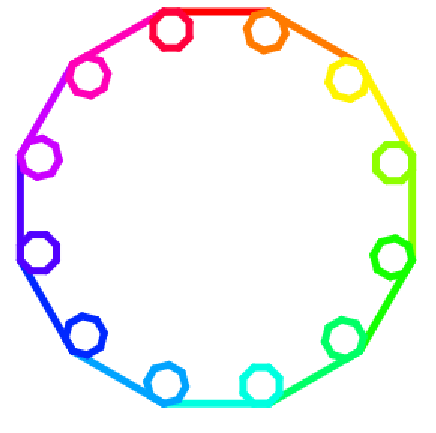

C. 

D. 

---

## 第2题（2分）
设计一个和在20以内（包括20）的整数加法程序，已知其中一个数为7，另一个数用随机数积木表示，下面几个积木中，哪个最为合适？（ ）

A. 

B. 

C. 

D. 

---

## 第3题（2分）
关于广播的说法，下面哪个是正确的？（ ）

A. 广播指令发出后，只有自己可以接收到。

B. 广播指令发出后，只有其它角色可以接收到。

C. 广播指令发出后，所有角色都可以接收到。

D. 背景不能接收广播的消息。

---

## 第4题（2分）
设计《新年焰火晚会》程序，每发送一个指令燃放一批焰火（不同焰火角色），焰火消失后再发出下一指令，从而控制下一批焰火的燃放。下面哪个程序最合适？（ ）

A. 

B. 

C. 

D. 

---

## 第5题（2分）
关于克隆体的说法，下面哪个选项是正确的？（ ）

A. 角色只能克隆自己，不能克隆其它角色。

B. 如果本体隐藏，是无法实现克隆的。

C. 克隆体克隆出来后，克隆体可以执行下图"克隆"积木后的程序。

D. 角色程序如下图所示，克隆体克隆出来后，会执行"当作为克隆体启动时"后面的程序。

---

## 第6题（2分）
下面哪个程序多次运行后，角色"说"出的结果可能大于20？（ ）

A. 

B. 

C. 

D. 

---

## 第7题（2分）
关于本体和克隆体的说法，下面哪个选项是正确的？（ ）

A. 本体和克隆体都可以使用"删除此克隆体"积木删除掉

B. 克隆体的隐藏和删除本质上是一样的

C. 不可以编程用积木删除本体，但可以编程用积木删除克隆体

D. 克隆体不能被再次克隆

---

## 第8题（2分）
能得到下面图形是哪个脚本？（ ）

A. 

B. 

C. 

D. 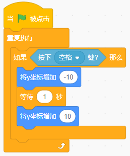

---

## 第9题（2分）
下面哪个程序，点击5次绿旗，每次变量A的值都可能不同的是？（ ）

A. 

B. 

C. 

D. 

---

## 第10题（2分）
下面哪个积木不能得到一个随机小数？（ ）

A. 

B. 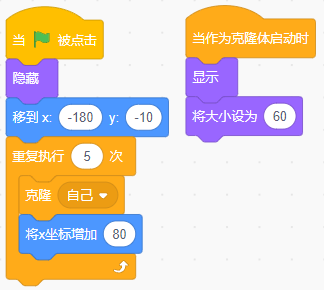

C. 

D. 

---

## 第11题（2分）
舞台均匀放置4个气球，小猫位于当前位置，执行下面的程序，正确的说法是？（ ）

A. 小猫跑到中间遇到绿色气球停止

B. 小猫跑到右边遇到蓝色气球停止

C. 小猫会一直跑

D. 小猫遇到黄色气球停止

---

## 第12题（2分）
下面哪个程序执行后，变量A一定是整数。（ ）

A. 

B. 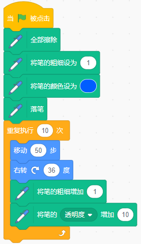

C. 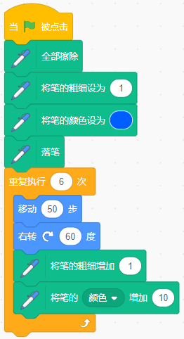

D. 

---

## 第13题（2分）
下面的程序执行5分钟后，将会产生多少个克隆体？（ ）

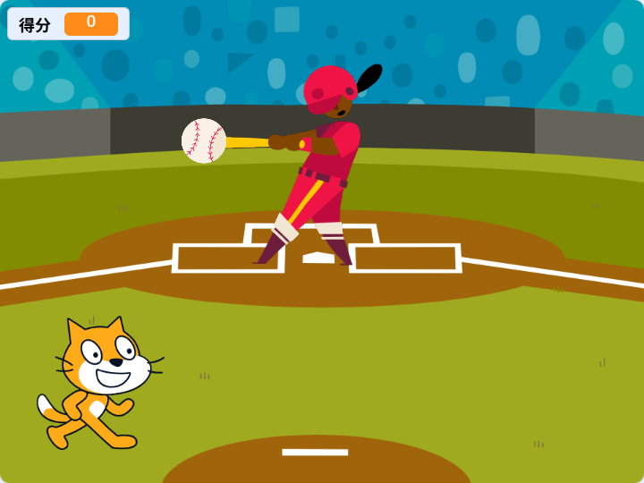

A. 无数个

B. 3000个左右

C. 300个左右

D. 1023个左右

---

## 第14题（2分）
下面哪种说法正确？（ ）

A. 在舞台上击右键，可以新建变量。

B. 在代码区击右键可以新建变量。

C. 可以在程序中用"新建变量"积木新建变量。

D. 只能在积木区"变量"中，通过点击"新建一个变量"按钮建立变量。

---

## 第15题（2分）
在《龟兔赛跑》游戏中，当"小猫"发出指令："预备-跑"后，小乌龟及小兔子开始跑起来，而旁边的其它小动物都在为它们加油，要实现这个程序，用下面哪种方法最方便？（ ）

A. 侦测小猫的声音

B. 侦测小猫的造型

C. 广播消息

D. 无法实现

---

## 第16题（2分）
执行下面程序，角色将说出？（ ）

A. Windows

B. Macos

C. sa

D. wM

---

## 第17题（2分）
执行下面程序，画出的图形是？（ ）

A. 

B. 

C. 

D. 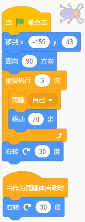

---

## 第18题（2分）
有17个男生和13个女生围成一圈，至少有几个男生旁边也是男生？（ ）

A. 4个

B. 5个

C. 6个

D. 8个

---

## 第19题（2分）
下面哪个不是变量在舞台上的显示模式？（ ）

A. 正常模式

B. 大字模式

C. 小字模式

D. 滑杆模式

---

## 第20题（2分）
小明设计一个通过抽取学号，请同学表演节目的程序。已知班上共30个人，下面哪个积木最为合适？（ ）

A. 

B. 

C. 

D. 

---

## 第21题（2分）
角色从图形中心的位置开始绘制，哪个选项可以绘制出下面的图案？（ ）

A. 

B. 

C. 

D. 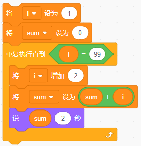

---

## 第22题（2分）
已知四个变量a=10，b=20，c=30，d=40，执行下面程序，角色会说？（ ）

A. 10

B. 40

C. true

D. false

---

## 第23题（2分）
三人参加短跑比赛，甲说我不是第一，乙说我不是第二，丙说甲是第三。则他们的获奖情况是？（ ）

A. 甲是第一，乙是第二名，丙是第三名。

B. 甲是第三，乙是第二名，丙是第一名。

C. 甲是第三，乙是第一名，丙是第二名。

D. 甲是第二，乙是第一名，丙是第三名。

---

## 第24题（2分）
执行下面的脚本，得到的图形是？（ ）

A. 

B. 

C. 

D. 

---

## 第25题（2分）
下面这个程序有Bug，执行程序后，哪个说法是正确的？（ ）

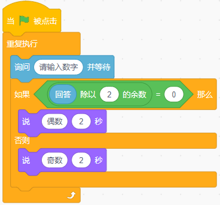

A. 输入60分，说"合格"。

B. 输入80分，说"良好"。

C. 输入90分，说"优秀"。

D. 输入50分，什么也不说。

---

# 二、判断题（共10题，共20分）

## 第26题（2分）
下面的积木，不能得到1到10的随机整数。

- 正确
- 错误

---

## 第27题（2分）
执行下面程序，变量N的值不会超过50。

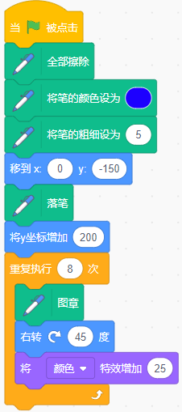

- 正确
- 错误

---

## 第28题（2分）
执行下面程序，角色从1数到10。

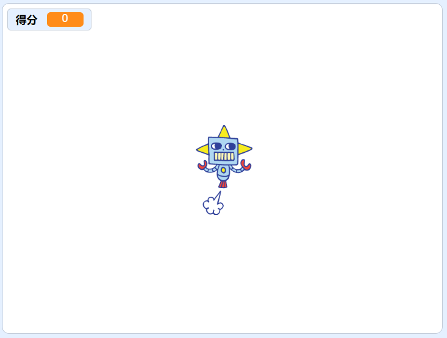

- 正确
- 错误

---

## 第29题（2分）
"克隆"和"图章"都可以复制出新的角色，不过图章出来的角色不能用移动指令。

- 正确
- 错误

---

## 第30题（2分）
背景里也可以建立局部变量，并被角色所使用。

- 正确
- 错误

---

## 第31题（2分）
修改变量名，程序中对应的变量名会自动改变。

- 正确
- 错误

---

## 第32题（2分）
"广播消息并等待"积木发出消息后，要等待所有接收消息的代码执行完成后才继续向下执行。

- 正确
- 错误

---

## 第33题（2分）
"全部擦除"指令将清除舞台上所有存在的图形，包括角色和背景。

- 正确
- 错误

---

## 第34题（2分）
抬笔后移动画笔，不能在舞台画出图形。

- 正确
- 错误

---

## 第35题（2分）
执行下面程序后，N的结果为6。

- 正确
- 错误

---

# 三、编程题（共3题，共30分）

## 第36题（10分）小鸡吃虫

**1. 准备工作**

（1）选择背景Garden-rock，删除原空白背景；

（2）选择角色Grasshopper、Chick，置于舞台图示位置，设置Grasshopper的初始大小为30%，状态为隐藏；删除小猫；

（3）建立全局变量"得分"，在舞台显示为"正常显示"。

**2. 功能实现**

（1）点击绿旗后，角色Chick满屏幕走动；

（2）点击绿旗后，角色Grasshopper每隔1秒克隆一次，克隆体出来后立即显示，并每隔1秒移动到舞台随机位置；

（3）变量"得分"初始值设定为0，角色Grasshopper的克隆体碰到Chick，"得分"加1，如果"得分"为10，则游戏结束。

###### 作答链接： <a href="http://fslong.iok.la:32411/scratch/edit" target="_blank">右键新标签页打开答题</a>

---

## 第37题（10分）接苹果

**1. 准备工作**

（1）保留原空白背景；

（2）保留原小猫角色，选择角色Apple，Button2，为Button2添加文字"开始"，作为命令发布按钮。所有角色置于舞台图示位置；

（3）建立全局变量"得分"，在舞台显示为"正常显示"。

**2. 功能实现**

（1）点击绿旗后，"得分"清零，角色Apple隐藏；

（2）点击"开始"按钮，广播"开始"后按钮隐藏；

（3）接收到"开始"，苹果在屏幕上方，任意水平位置每隔0.5秒克隆一次。克隆体出来后立即显示，并不断下落；

（4）用鼠标控制小猫左右移动（x坐标跟随鼠标变化），接住苹果，不让其落地。当接住苹果，加1分，苹果消失；

（5）如果"得分"≥100分，或者苹果触地（y坐标<-160），游戏结束。

###### 作答链接： <a href="http://fslong.iok.la:32411/scratch/edit" target="_blank">右键新标签页打开答题</a>

---

## 第38题（10分）加法出题机

**1. 准备工作**

（1）保留空白背景；

（2）保留原默认小猫角色，选择Button2，在造型选项卡里为其添加文字"开始"。各角色置于舞台合适位置；

（3）建立4个全局变量"A"（加数）、"B"（另一个加数）、"C"（和）、"得分"。除"得分"在舞台正常显示外，其余均隐藏。

**2. 功能实现**

（1）点击绿旗后，所有变量初始化值为0；

（2）点击"开始"按钮，发送开始指令；

（3）当小猫接收到开始指令，向用户出示加数在1-99范围内的加法题；

（4）每答对一题，小猫说"正确"，加10分；得分100分程序结束。

###### 作答链接： <a href="http://fslong.iok.la:32411/scratch/edit" target="_blank">右键新标签页打开答题</a>

---
