

# 202106图形化三级
> 编程非难事，只怕有心人。
> 图形化之巧，逻辑为先；积木之叠，思维为要。

---

# 一、单选题（共25题，共50分）

## 第1题（2分）
下图中的程序执行一次之后，"我的变量"最终的值是？（ ）

A. 0或者1

B. true或者false

C. 包含或者不包含

D. 成立或者不成立

---

## 第2题（2分）
如果你的平均成绩是93分，数学是95分，运行下面程序后角色会？（ ）

A. 说"祝贺你"

B. 说"抱歉，数学分数太低"

C. 说"抱歉，平均分太低"

D. 什么都不说

---

## 第3题（2分）
如果a=7，b=2，c=9，执行下面程序后，角色会说？（ ）

A. 红色

B. 绿色

C. 蓝色

D. 白色

---

## 第4题（2分）
以下选项执行一次之后能够画出下图中的图形的是？（ ）

A. 

B. 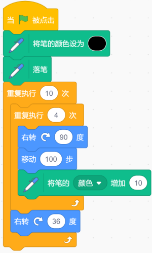

C. 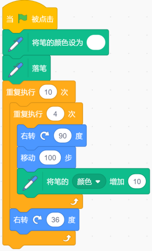

D. 

---

## 第5题（2分）
运行下面程序后，角色说的内容不可能是？（ ）

A. 2.2472129659666074

B. 1.37

C. 9.6

D. 7

---

## 第6题（2分）
"旋转跳跃我不停歇……"，小猫随着歌声翩翩起舞，并且记录了自己的每一个动作，以下选项中的程序执行一次之后没有记录小猫舞蹈动作的是？（ ）

A. 

B. 

C. 

D. 

---

## 第7题（2分）
"在1和8之间取随机数"的意思是？（ ）

A. 从1到8之间取整数，包括1和8

B. 从1到8之间取小数，包括1和8

C. 从1到8之间取整数，不包括1和8

D. 从1到8之间取小数，不包括1和8

---

## 第8题（2分）
下面程序执行一次之后，角色说出的内容不可能是？（ ）

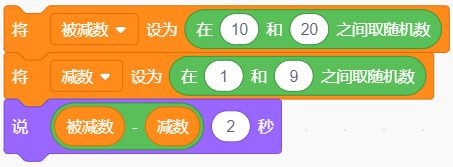

A. 1

B. 11

C. 20

D. 2

---

## 第9题（2分）
实现累加计算用到的积木有？（ ）

A. 重复执行

B. 广播

C. 克隆

D. 随机数

---

## 第10题（2分）
小猫在森林里面玩耍时捡到一个宝贝，它发现这个宝贝有一个神奇的作用：它会复制放到里面的东西。以下选项中具有这个功能的是？（ ）

A. 克隆

B. 落笔

C. 移动

D. 旋转

---

## 第11题（2分）
在国王组织的春游活动中小猫的背包里面装了好朋友最喜欢的香蕉，小猴子的背包里面装了好朋友最喜欢的小鱼干，以下选项中能够让两位好朋友背包内的东西互换的是？（ ）

A. 

B. 

C. 

D. 

---

## 第12题（2分）
执行下面程序后，说的结果？（ ）

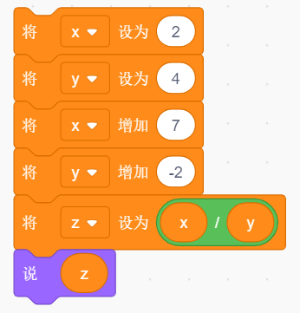

A. 4

B. 5

C. 4.5

D. 6

---

## 第13题（2分）
科技达人Casey给图书馆做了一款噪音检测提示系统，当图书室声音小于等于30时，画面显示笑脸，当声音大于30时，显示难受的表情，并且语音提示"保持安静"。以下哪个选项可以实现这个检测功能？（ ）

A. 

B. 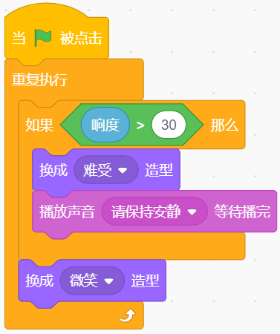

C. 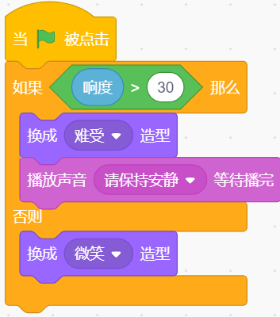

D. 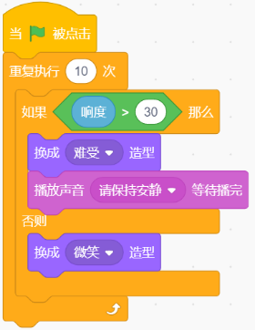

---

## 第14题（2分）
在跑步比赛中，起点裁判发布消息"预备"，等待终点裁判准备就绪后，起点裁判才会下达"开始"的命令。下面哪个选项可以实现这个功能？（ ）

A. 

B. 

C. 

D. 

---

## 第15题（2分）
在捉蚱蜢游戏中，背景如下图所示，能够实现蚱蜢在整片草地的随机位置出现的选项是？（ ）

A. 

B. 

C. 

D. 

---

## 第16题（2分）
下面程序绘制的图形是？（ ）

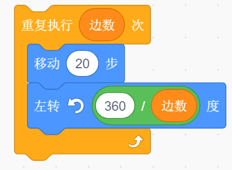

A. 只能绘制正四边形

B. 只能绘制正五边形

C. 可以绘制任意长度的多边形

D. 改变变量边数的值，可以绘制不同的正多边形

---

## 第17题（2分）
角色A的程序如左图所示，角色B的程序如右图所示。点击绿旗，什么时候说"真棒"？（ ）

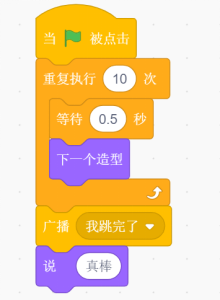  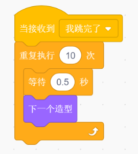

A. 角色A开始切换造型时

B. 角色A造型切换十次完成后

C. 角色B造型切换十次完成后

D. 不会说此句

---

## 第18题（2分）
下图中的程序执行一次之后，变量a、b的值分别是多少？（ ）

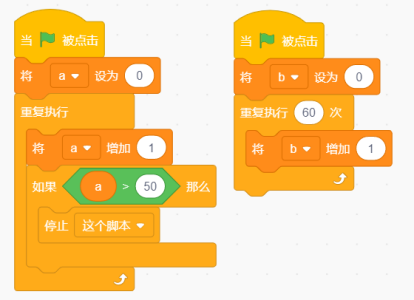

A. 50 60

B. 50 61

C. 51 60

D. 51 61

---

## 第19题（2分）
默认小猫角色，初始位置在舞台中心，下面程序执行一次后，下面哪个选项是正确的？（ ）

A. 小猫走动一段距离后，停下来，但是没有颜色变化

B. 小猫原地不动，但颜色发生变化

C. 小猫来回走动，同时颜色发生变化

D. 小猫走动一段距离后，停下来，接着颜色不停的发生变化

---

## 第20题（2分）
执行下面程序，角色会说？（ ）

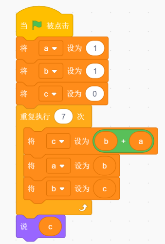

A. 34

B. 28

C. 51

D. 42

---

## 第21题（2分）
小猫和小伙伴玩扔骰子走格子游戏。在游戏中小猫和小伙伴会根据背景中的方格指示运动和并能自动转向，且移动一步刚好是一个方格。游戏背景图如下第一张图所示，那么按照第二张图中的程序，重复执行直到里的程序最少执行多少次，小猫能够到达终点？（ ）

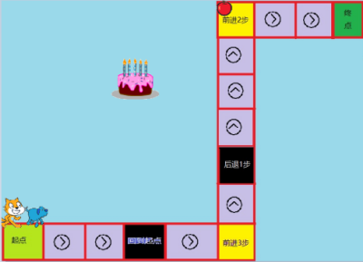  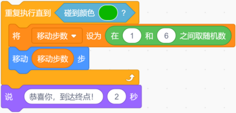

A. 2

B. 3

C. 4

D. 5

---

## 第22题（2分）
下面程序画出的图形是？（ ）

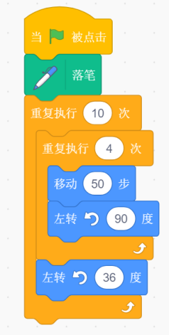

A. 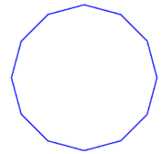

B. 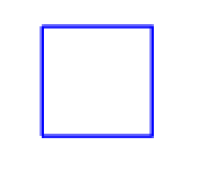

C. 

D. 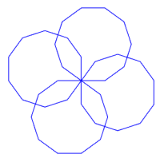

---

## 第23题（2分）
下面程序绘制的图形是？（ ）

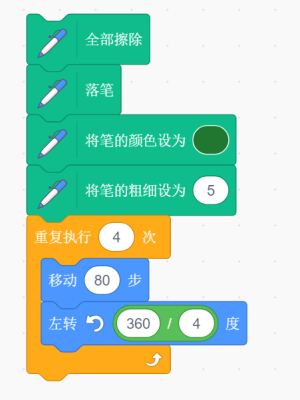

A. 正方形

B. 正三角形

C. 长方形

D. 圆

---

## 第24题（2分）
小猫和角色bell在舞台左侧边缘，如右图所示。小猫的程序如左图所示，角色bell没有任何程序，执行下面程序一次后，舞台上出现的内容是？（ ）

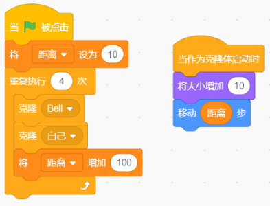  

A. 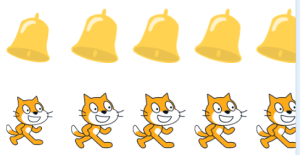

B. 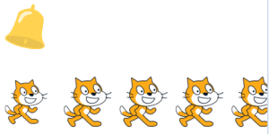

C. 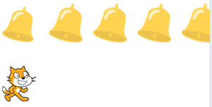

D. 

---

## 第25题（2分）
克隆体的总数上限大约是？（ ）

A. 100

B. 200

C. 300

D. 400

---

# 二、判断题（共10题，共20分）

## 第26题（2分）
图章工具能够复制角色的所有外观属性，例如大小、显示、隐藏、颜色、虚像、马赛克等特效。

- 正确
- 错误

---

## 第27题（2分）
广播和变量都能起到在角色之间进行信息传递的作用。

- 正确
- 错误

---

## 第28题（2分）
随机数积木只能生成指定范围内的随机整数。

- 正确
- 错误

---

## 第29题（2分）
在程序编写中，只要使用了"重复执行"就会造成死循环。

- 正确
- 错误

---

## 第30题（2分）
变量名可以用字母、数字、特殊符号等命名。

- 正确
- 错误

---

## 第31题（2分）
使用画笔中的落笔积木后必须使用抬笔，才能够在舞台上画出痕迹。

- 正确
- 错误

---

## 第32题（2分）
如果a的值为95，执行下面程序，角色会说"成绩相当好"。

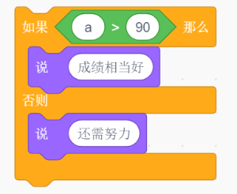

- 正确
- 错误

---

## 第33题（2分）
执行下列程序后，我的变量的值是32。

- 正确
- 错误

---

## 第34题（2分）
广播也可以像变量一样设定其作用范围为"适用于所有角色"和"仅适用于当前角色"两种状态。

- 正确
- 错误

---

## 第35题（2分）
角色可以克隆自己也可以克隆别的角色及舞台。

- 正确
- 错误

---

# 三、编程题（共3题，共30分）

## 第36题（10分）躲球游戏

控制小猫尽量躲开小球。

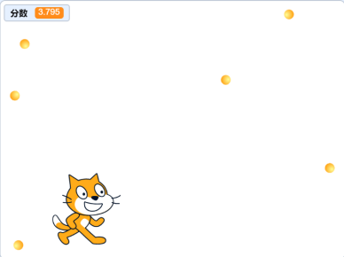 

**1. 准备工作**

（1）背景：使用原始空白背景；

（2）角色：除原有小猫角色外，添加角色：Ball；

（3）变量：建立变量"分数"。

**2. 功能实现**

（1）用上、下、左、右方向键控制小猫移动；

（2）使用克隆，克隆出6个球；

（3）克隆体出现在随机位置，面向随机方向移动，碰到边缘就反弹；

（4）分数一直变化，是计时器的数值，时间越长，分数越高；

（5）当小猫碰上小球，小猫和小球全部消失，出现"游戏结束"四个字，游戏结束。

###### 作答链接： <a href="http://fslong.iok.la:32411/scratch/edit" target="_blank">右键新标签页打开答题</a>

---

## 第37题（10分）计算成绩总和

小猫帮助老师计算出班级成绩总和。

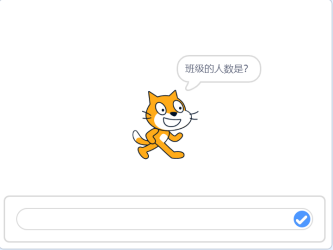 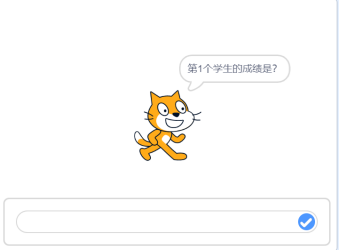 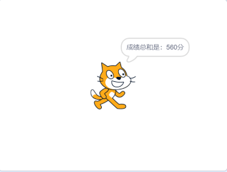

**1. 准备工作**

（1）保留白色背景及默认小猫角色。

**2. 功能实现**

（1）询问"班级的人数是？"，输入班级人数；

（2）根据班级总人数依次询问"第x个学生的成绩是？"，依次输入每一位同学的成绩；

（3）小猫计算出成绩总和，并说出"成绩总和是：xxx分"。

###### 作答链接： <a href="http://fslong.iok.la:32411/scratch/edit" target="_blank">右键新标签页打开答题</a>

---

## 第38题（10分）绘制图形

**1. 准备工作**

（1）默认的白色背景；

（2）默认的小猫角色。

**2. 功能实现**

（1）画笔的颜色为黑色，画笔的粗细为3；

（2）绘制如下的图形，边长自定义，图形不能超出舞台范围。

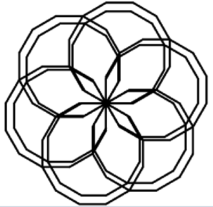

###### 作答链接： <a href="http://fslong.iok.la:32411/scratch/edit" target="_blank">右键新标签页打开答题</a>

---
