

# 202503图形化三级
> 编程非难事，只怕有心人。
> 图形化之巧，逻辑为先；积木之叠，思维为要。

---

# 一、单选题（共18题，共50分）

## 第1题（3分）
默认小猫角色，运行程序后，下列说法正确的是？（ ）

A. 小猫的颜色、位置在一直变化

B. 小猫在舞台中的位置在一直变化，颜色只变一次

C. 小猫的颜色和位置只发生一次变化

D. 小猫在舞台中的颜色在一直变化，位置只变一次

---

## 第2题（3分）
默认小猫角色，运行下列程序后，小猫面向的方向和走过的长度分别是？（ ）

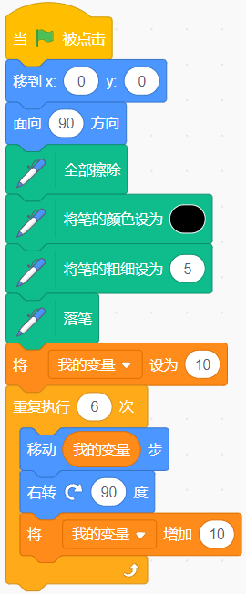

A. 面向-90方向，走过的长度为210

B. 面向90方向，走过的长度为60

C. 面向-90方向，走过的长度为60

D. 面向90方向，走过的长度为210

---

## 第3题（3分）
方块角色的造型如下左图所示，右图由100个方块组成，其中的数字是方块角色的造型编号，请问右图对应的图案为？（ ）

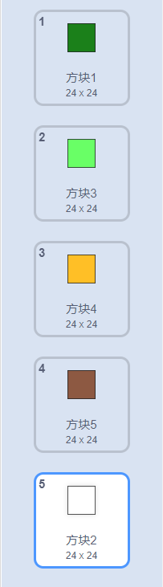 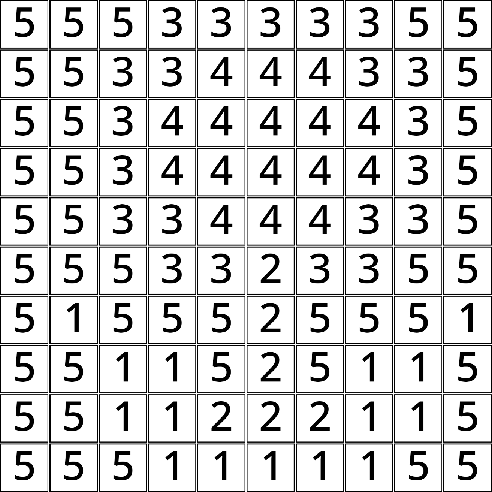

A. 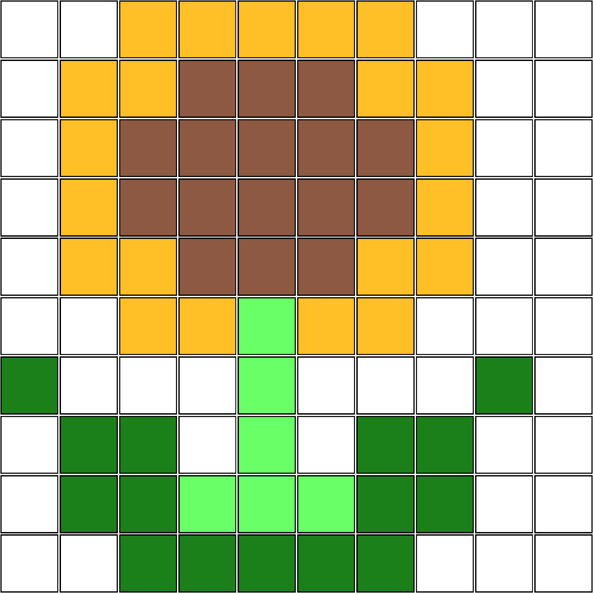

B. 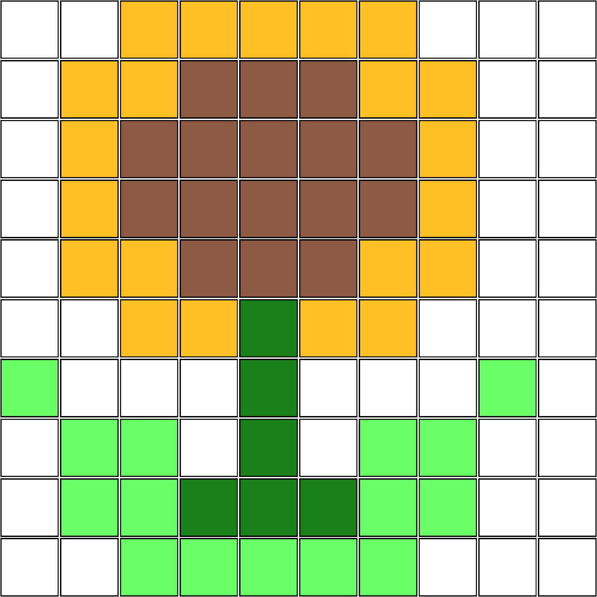

C. 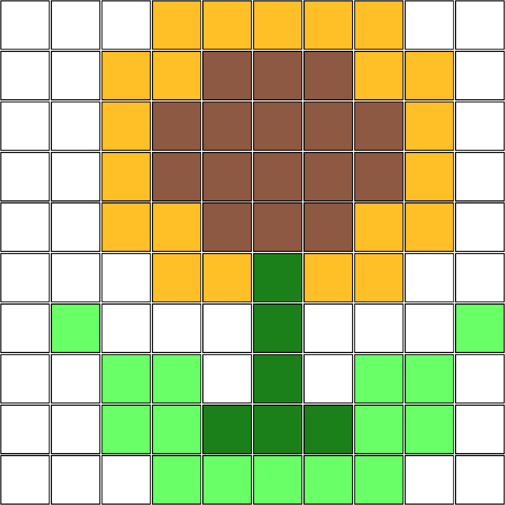

D. 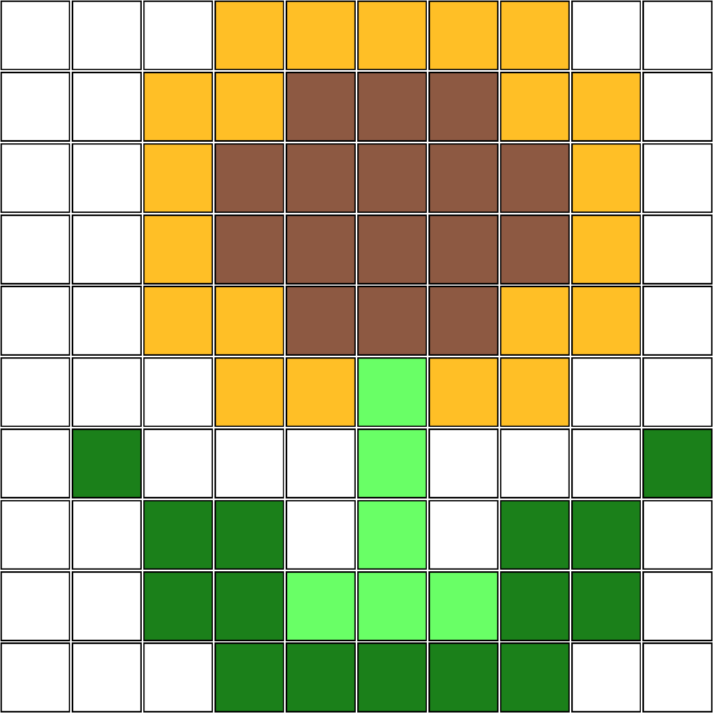

---

## 第4题（3分）
默认小猫角色，运行下列程序后，舞台上能看到的图案是？（ ）

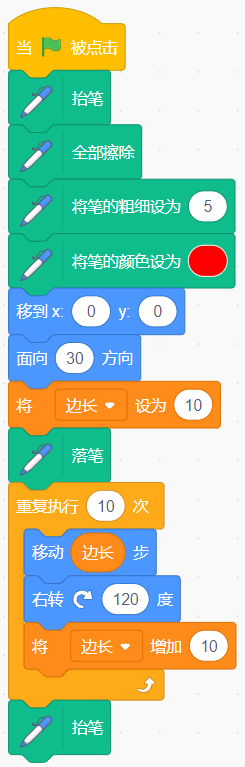

A. 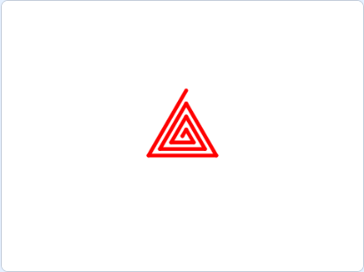

B. 

C. 

D. 

---

## 第5题（3分）
角色"砖块"的大小为40*30，运行下列程序后，舞台上能看到如左图所示的金字塔图案，那么红框处应该填写？（ ）

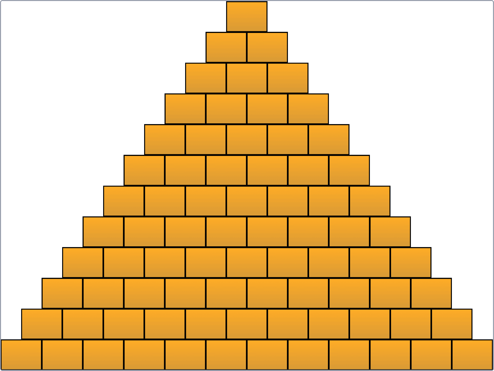 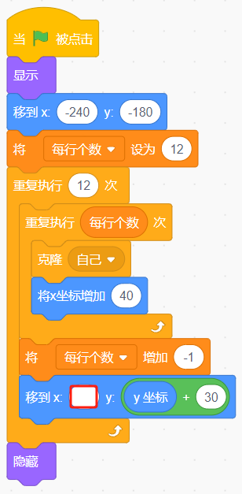

A. 

B. 

C. 

D. 

---

## 第6题（3分）
默认小猫角色，运行下列程序后，小猫说？（ ）

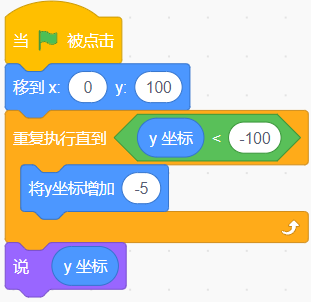

A. -105

B. -100

C. -95

D. 95

---

## 第7题（3分）
某同学制作了一个模拟音乐播放器的作品，其中有一个按钮角色，造型如下图所示，点击处于播放造型的按钮时，可以开始播放音乐；点击处于暂停造型的按钮时，可以使正在播放的音乐暂停。下列哪个选项可以实现这个效果？（ ）

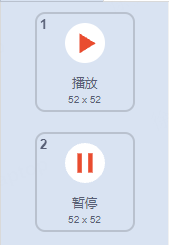

A. 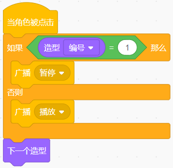

B. 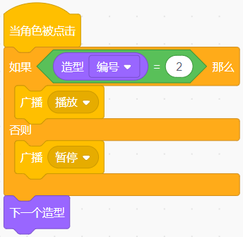

C. 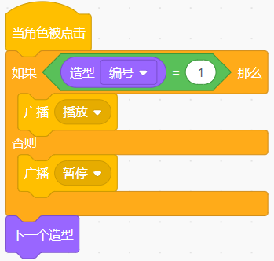

D. 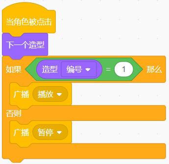

---

## 第8题（2分）
运行下列程序，5分钟后，舞台上大约能看见多少个钻石？（ ）

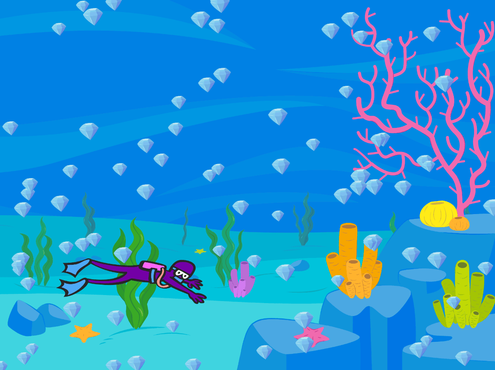 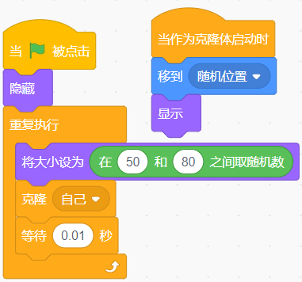

A. 100

B. 200

C. 300

D. 400

---

## 第9题（3分）
默认小猫角色，运行下列程序后，小猫说？（ ）

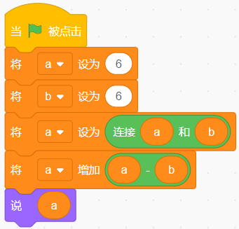

A. 12

B. 18

C. 126

D. 138

---

## 第10题（3分）
学校安装了一款自动感应水龙头，如果检测到与手的距离小于8，同时温度大于32°C时，就打开水龙头，否则关闭水龙头。那么如下图所示的程序红框处应填写？（ ）

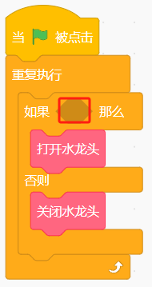

A. 

B. 

C. 

D. 

---

## 第11题（3分）
默认小猫角色，运行下列程序，小猫最终说出？（ ）

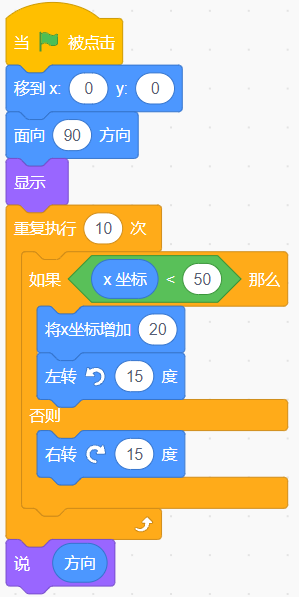

A. 90

B. 120

C. 150

D. 180

---

## 第12题（3分）
运行下列程序后，角色说出的最大数是？（ ）

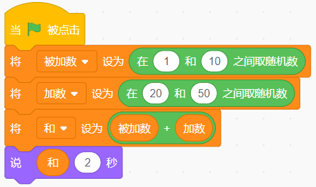

A. 21

B. 30

C. 51

D. 60

---

## 第13题（2分）
想在舞台上画出一个圆形，运行下列程序后，舞台区没有出现圆形，下列程序缺少了哪一个积木？（ ）

A. 

B. 

C. 

D. 

---

## 第14题（3分）
默认小猫角色，程序运行前是显示状态，运行下列程序后，舞台上能看到？（ ）

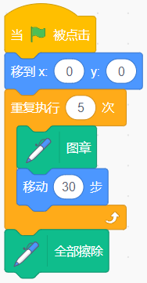

A. 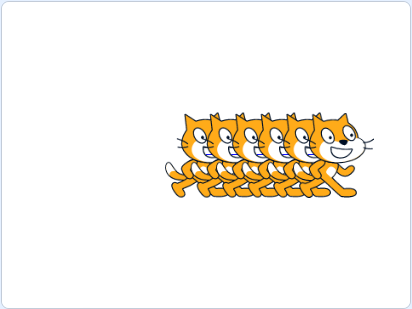

B. 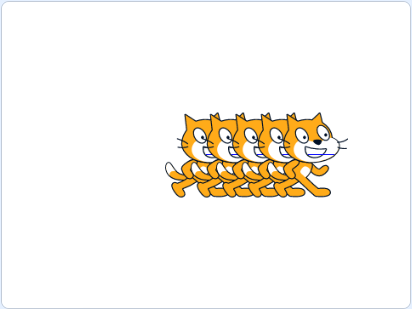

C. 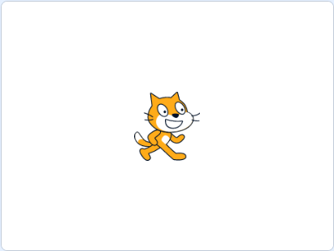

D. 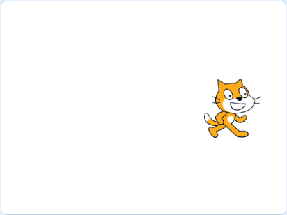

---

## 第15题（3分）
某次考试，A，B，C三人的得分互不相同。
A说："我得了96分。"
B说："我的得分恰好是我们三人的平均分。"
C说："我的得分是比 B 低 2 分。"
下列说法正确的是？（ ）

A. B的得分是95

B. B的得分是94

C. B的得分是93

D. B的得分是92

---

## 第16题（3分）
关于克隆体，下列描述正确的是？（ ）

A. 克隆与本体没有任何关系

B. 克隆体可以被删除

C. 克隆体的大小不可以更改

D. 克隆体的造型不可以更改

---

## 第17题（2分）
默认小猫角色，显示状态，运行下列程序后，舞台上最多可以看到几只小猫？（ ）

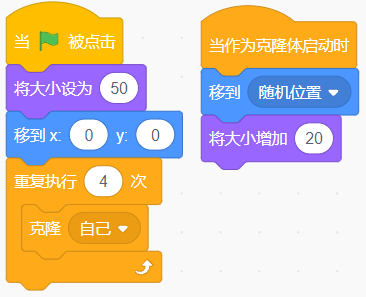

A. 2

B. 3

C. 4

D. 5

---

## 第18题（2分）
运行下列程序后，变量i的值是？（ ）

A. 1

B. 2

C. 13

D. 21

---

# 二、判断题（共10题，共20分）

## 第19题（2分）
默认小猫角色处于显示状态，运行下列程序后，舞台上最多能看到五只小猫。（ ）

- 正确
- 错误

---

## 第20题（2分）
按照下列规律摆放卡牌，最后一个摆放的应该是蓝桃。（ ）

- 正确
- 错误

---

## 第21题（2分）
小球角色的造型和程序如下图所示，运行程序后，舞台上小球分布如右图所示。（ ）

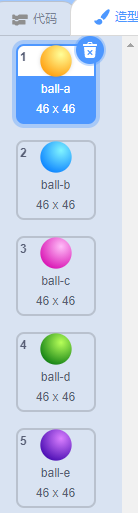 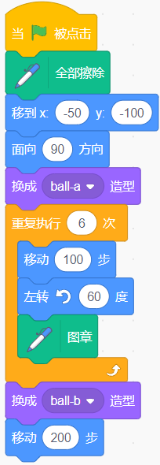 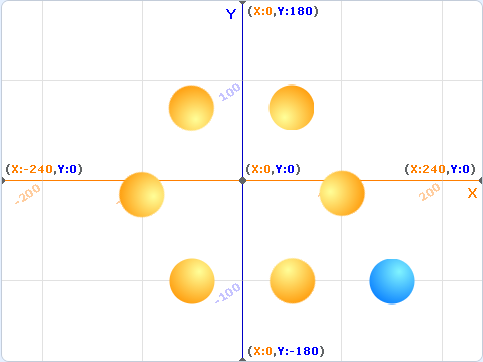

- 正确
- 错误

---

## 第22题（2分）
某班级要举行拔河比赛，想把学号1到40的学生分为两组，单数学号为第一小组，偶数学号为第二小组。下列程序可以实现这个需求。（ ）

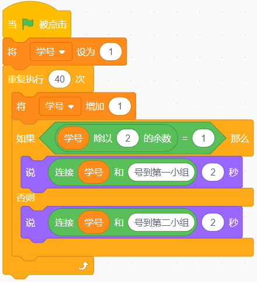

- 正确
- 错误

---

## 第23题（2分）
默认小猫角色，运行下列程序，会说出1+2+3+...+100的和。（ ）

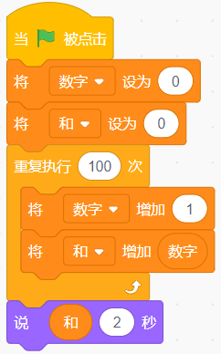

- 正确
- 错误

---

## 第24题（2分）
创建一个变量，这个变量的初始值只能是数字。（ ）

- 正确
- 错误

---

## 第25题（2分）
下列程序是死循环，会一直不停地运行。（ ）

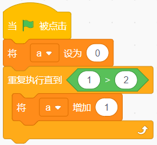

- 正确
- 错误

---

## 第26题（2分）
默认小猫角色，运行下列程序，能绘制出一个三角形。（ ）

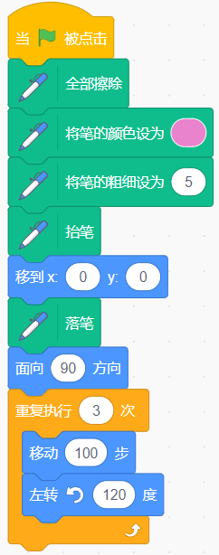

- 正确
- 错误

---

## 第27题（2分）
使用设置画笔粗细积木，画笔粗细最大只能设置成100。（ ）

- 正确
- 错误

---

## 第28题（2分）
克隆体不能再克隆自己。（ ）

- 正确
- 错误

---

# 三、编程题（共3题，共30分）

## 第29题（10分）绘制图形

**1. 准备工作**

（1）默认小猫角色；

（2）默认白色背景。

**2. 功能实现**

（1）小猫隐藏，初始位置为(0,0)，面向90方向，画笔颜色为绿色，粗细为6；

（2）绘制如下图所示的图形，四个正方形，边长自定义，不超出舞台即可。

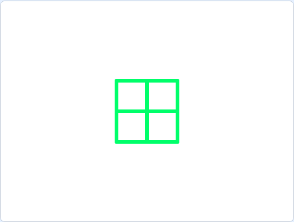

###### 作答链接： <a href="http://fslong.iok.la:32411/scratch/edit" target="_blank">右键新标签页打开答题</a>

---

## 第30题（10分）疯狂的海底世界

**1. 准备工作**

（1）删除默认小猫角色，添加角色：Crab、Starfish、Fish；

（2）添加背景Underwater 1。

**2. 功能实现**

（1）三个角色的大小都为80，初始位置如下图所示；

（2）点击绿旗，小鱼隐藏，螃蟹说"欢迎来到海底世界"2秒；

（3）螃蟹说完后，海星说"一大波鱼儿马上游来，快走！"2秒；

（4）螃蟹和海星垂直向上滑行到舞台上方；

（5）每隔1秒有一只小鱼出现在舞台最左侧垂直方向的随机位置，造型随机，水平向右不断游动，到达舞台最右侧后消失。

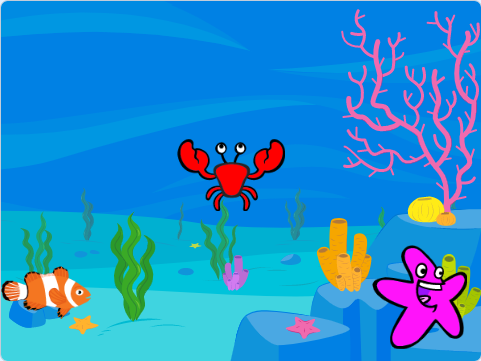 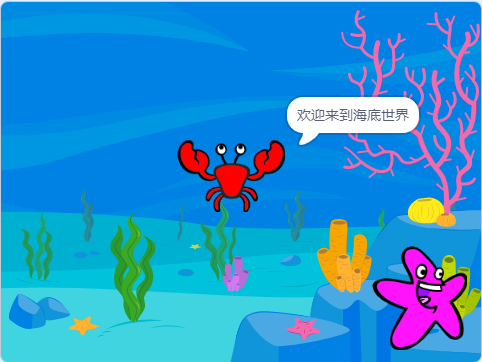 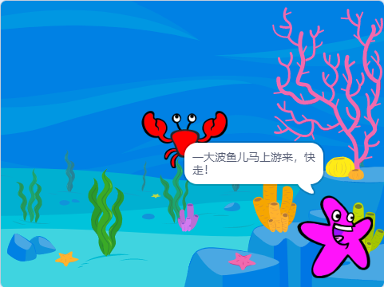 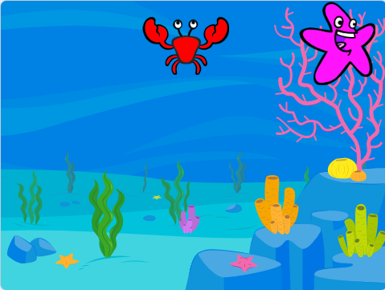 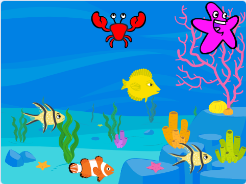

###### 作答链接： <a href="http://fslong.iok.la:32411/scratch/edit" target="_blank">右键新标签页打开答题</a>

---

## 第31题（10分）返回地球

**1. 准备工作**

（1）删除默认小猫角色，添加角色：Dot、Rocketship和Earth；

（2）添加背景：Galaxy。

**2. 功能实现**

（1）点击绿旗，角色初始位置如下图所示，小狗和地球的大小为50；

（2）小狗说"出发"2秒后隐藏；

（3）小狗说完后，火箭显示出来，初始大小为100，初始位置在舞台左下角，面向地球一边移动，一边变小；

（4）当火箭到达地球后消失。

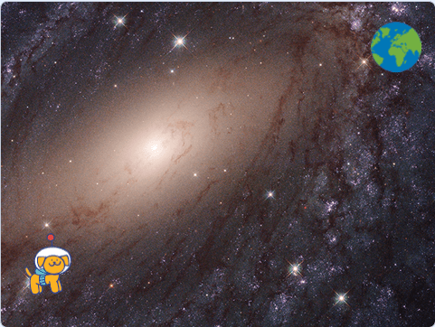 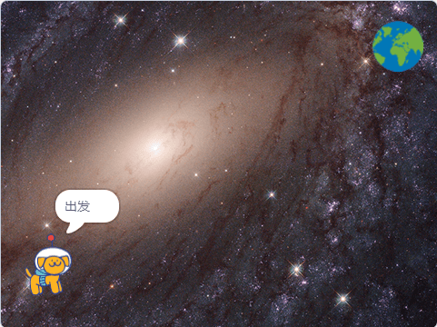 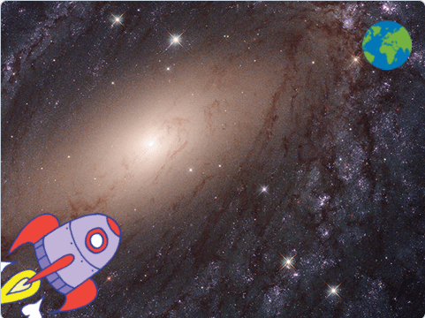 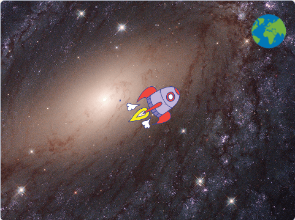 

###### 作答链接： <a href="http://fslong.iok.la:32411/scratch/edit" target="_blank">右键新标签页打开答题</a>

---
