

# 202506图形化三级
> 编程非难事，只怕有心人。
> 图形化之巧，逻辑为先；积木之叠，思维为要。

---

# 一、单选题（共18题，共50分）

## 第1题（3分）
下列程序标号1、2、3、4分别填入什么，可以绘制出如下右图所示的图案？（ ）

{height=400} {height=200}

A. 8 8 12 12

B. 12 12 8 8

C. 12 8 12 8

D. 8 12 8 12

---

## 第2题（3分）
下列积木的数值范围是多少？（ ）

A. 0到5

B. 5到6

C. 5到30

D. 0到30

---

## 第3题（3分）
变量余额的范围应该是多少？（ ）

A. 5-20元

B. 20-30元

C. 30-50元

D. 30-45元

---

## 第4题（3分）
默认小猫角色，运行程序后，下列选项说法错误的是？（ ）

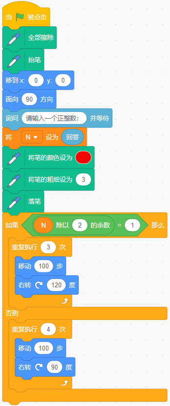

A. 输入1，画出1个三角形

B. 输入2，画出2个三角形

C. 输入4，画出1个正方形

D. 输入奇数，画出1个三角形

---

## 第5题（3分）
默认小猫角色，运行下列程序，舞台上能看到？（ ）

A. 

B. 

C. 

D. 

---

## 第6题（3分）
如果一颗麻将正、反两面代表两种状态，4颗麻将一起使用时，最多能代表几种状态？（ ）

A. 2

B. 4

C. 8

D. 16

---

## 第7题（3分）
默认小猫角色，运行下列程序后，小猫会说出？（ ）

A. 数字1到6

B. 数字1到5

C. 数字2到6

D. 数字2到5

---

## 第8题（2分）
守卫初始位置在舞台左侧，下列哪个选项能让守卫一直左右来回移动？（ ）

A. 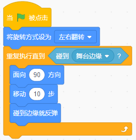

B. 

C. 

D. 

---

## 第9题（3分）
下列哪个选项可以实现，按下一次空格键，小恐龙能先原地跳起，再落回原地？（ ）

A. 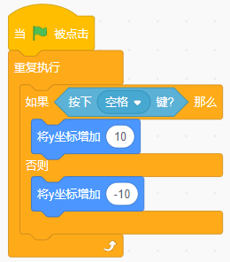

B. 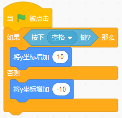

C. 

D. 

---

## 第10题（3分）
运行下列程序后，变量a的值为？（ ）

A. 2

B. 8

C. 16

D. 32

---

## 第11题（3分）
小狗特别喜欢吃骨头，每天都吃剩余骨头的一半又多吃一根，小狗运行下列程序后，会说？（ ）

A. 0

B. 2

C. 4

D. 6

---

## 第12题（3分）
苹果角色运行下列哪个选项后，可以生成如下图所示的5个大小不同的苹果？（ ）

A. 

B. 

C. 

D. 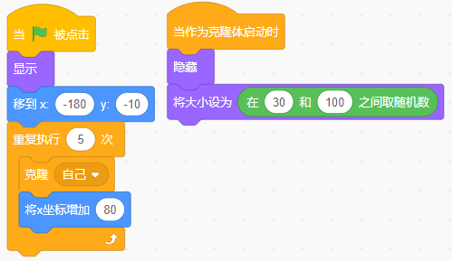

---

## 第13题（2分）
甲，乙和丙三人赛跑。比赛结束后，甲说："我跑的不是最快的，但至少比丙快"。由此可知，三个人中谁得到了第一名？（ ）

A. 甲

B. 乙

C. 丙

D. 无法判断

---

## 第14题（3分）
下列哪个选项的程序可以绘制出如下图所示的图形？（ ）

A. 

B. 

C. 

D. 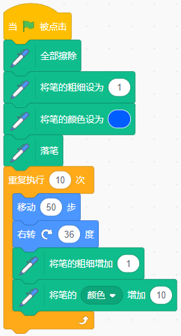

---

## 第15题（2分）
角色初始位置如下图所示，点击绿旗运行程序后，变量"得分"的值是？（ ）

  

A. 0

B. -3

C. 5

D. 2

---

## 第16题（2分）
汽车，小猫的初始位置和程序如下图所示，运行程序后，下列哪个选项的说法是正确的？（ ）

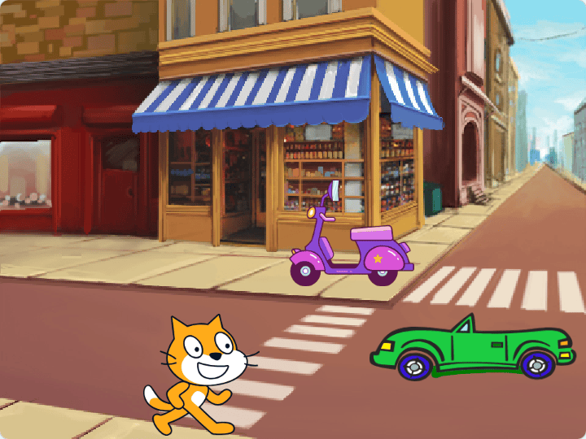

A. 程序运行1秒后，小猫到达电动车的位置

B. 程序运行1秒后，汽车会到达舞台的最左侧

C. 程序运行3秒后，汽车会到达舞台的最左侧

D. 程序运行4秒后，汽车会到达舞台的最左侧

---

## 第17题（3分）
点击绿旗运行下列程序后，舞台上能看到？（ ）

  

A. 

B. 

C. 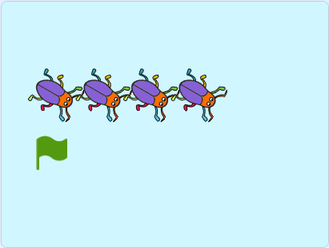

D. 

---

## 第18题（3分）
小猫角色有一个"仅适用于当前角色"的变量a，下列说法正确的是？（ ）

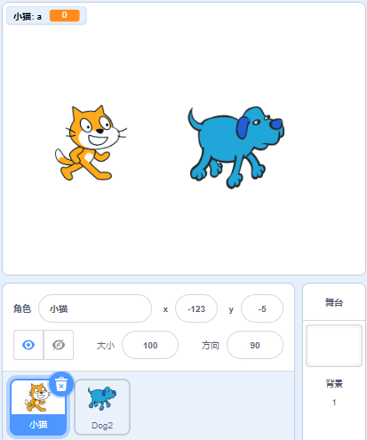

A. 变量a是小猫角色的私有变量，其它角色或舞台都无法读取变量a的值

B. 小狗角色可以正常读取和修改变量a

C. 舞台角色可以正常读取和修改变量a

D. 其它角色和舞台不能直接修改变量a，但可以通过积木读取a

---

# 二、判断题（共10题，共20分）

## 第19题（2分）
默认小猫角色，运行下列程序，最后说出的数值是100。（ ）

- 正确
- 错误

---

## 第20题（2分）
默认小猫角色，运行下列程序，可以从左到右画出一条长度为100的直线。（ ）

- 正确
- 错误

---

## 第21题（2分）
新建一个变量，若在程序中使用了这个变量，则不能再修改变量名。（ ）

- 正确
- 错误

---

## 第22题（2分）
小猫初始大小为100，运行下列程序后，小猫会变大。（ ）

- 正确
- 错误

---

## 第23题（2分）
下列程序可以实现1-99的奇数的累加（1+3+5......+99）。（ ）

- 正确
- 错误

---

## 第24题（2分）
默认小猫角色，运行下列程序后，小猫可能会面向左侧。（ ）

- 正确
- 错误

---

## 第25题（2分）
变量"数字1"和"数字2"的初始值如下图所示，运行下列程序后，变量"数字1"和"数字2"的值分别为：7、3。（ ）

 

- 正确
- 错误

---

## 第26题（2分）
默认小猫角色，运行下列程序后，可以绘制出如下右图所示的图形。（ ）

 

- 正确
- 错误

---

## 第27题（2分）
默认小猫角色，运行下列程序，按下2次空格键，舞台上最多能看到3只小猫。（ ）

- 正确
- 错误

---

## 第28题（2分）
运行下列程序，输入数字后，可以判断数字是奇数还是偶数。（ ）

- 正确
- 错误

---

# 三、编程题（共3题，共30分）

## 第29题（10分）绘制帽子花

**1. 准备工作**

（1）添加背景：Forest；

（2）删除默认小猫角色，添加角色：Winter Hat，将造型中心点设为帽子顶部。

**2. 功能实现**

（1）擦除舞台所有画笔痕迹，将画笔的颜色设为蓝色，粗细设为5；

（2）从舞台下方垂直向上，绘制一条长度为200的线段；

（3）绘制八片花瓣，每片花瓣的颜色都不相同。

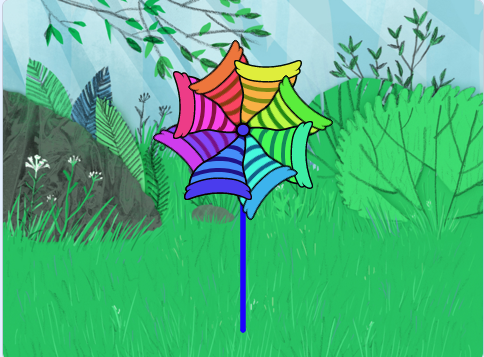

###### 作答链接： <a href="http://fslong.iok.la:32411/scratch/edit" target="_blank">右键新标签页打开答题</a>

---

## 第30题（10分）智能病毒杀灭机器人

**1. 准备工作**

（1）删除默认小猫角色，添加角色robot，添加角色Ghost代表病毒；

（2）默认白色背景。

**2. 功能实现**

（1）机器人大小为50，初始位置在舞台中心，病毒隐藏，变量"得分"初始值为0；

（2）1秒后，克隆出8个病毒，克隆体大小为30，位置随机；

（3）按上下左右键能控制机器人上下左右移动，运动过程中面向方向不变，始终面向90方向；

（4）机器人碰到病毒，病毒消失，得分加1；

（5）当全部病毒被杀灭，机器人说"病毒已全部清理！"2秒，程序结束。

###### 作答链接： <a href="http://fslong.iok.la:32411/scratch/edit" target="_blank">右键新标签页打开答题</a>

---

## 第31题（10分）随机挑人器

设计一款随机挑人程序，只要输入班级总人数，屏幕不断出现同学学号，最后停留在被抽到的学号上。

**1. 准备工作**

（1）默认小猫角色；

（2）添加Concert背景。

**2. 功能实现**

（1）小猫询问："请输入班级总人数："；

（2）每个学生一个学号，学号从1开始，最大学号为班级人数，重复班级人数次，每隔0.1秒小猫说出一个随机学号；

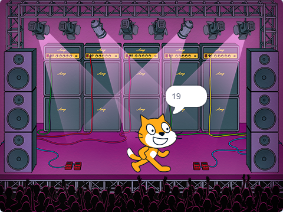

（3）小猫说出最后抽到的学号回答问题，说"请XX号同学回答问题"2秒。

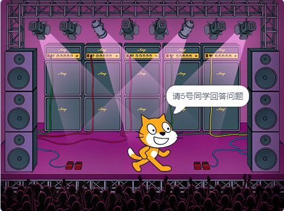

###### 作答链接： <a href="http://fslong.iok.la:32411/scratch/edit" target="_blank">右键新标签页打开答题</a>

---
