

# 202509图形化三级
> 编程非难事，只怕有心人。
> 图形化之巧，逻辑为先；积木之叠，思维为要。

---

# 一、单选题（共18题，共50分）

## 第1题（3分）
运行下列程序后，变量c的值是？（ ）

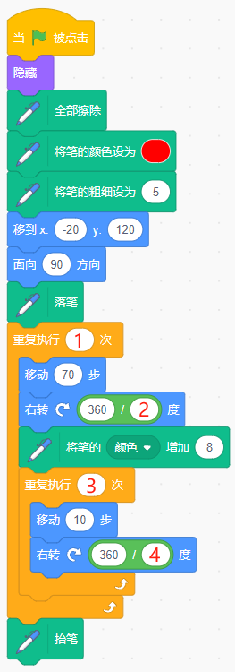

A. 3

B. 1

C. 2

D. 6

---

## 第2题（3分）
气球有3个造型，下列哪个选项不能让气球角色换成随机的造型？（ ）

 

A. 

B. 

C. 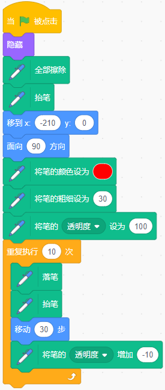

D. 

---

## 第3题（3分）
运行下列程序后，甲壳虫的坐标是？（ ）

 

A. (10,0)

B. (0,10)

C. (100,100)

D. (10,100)

---

## 第4题（3分）
默认小猫角色，运行下列程序，输入数字6，会绘制出哪个图案？（ ）

A. 

B. 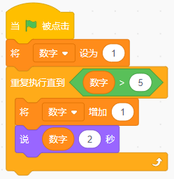

C. 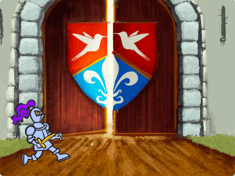

D. 

---

## 第5题（2分）
下列哪个积木不是循环语句？（ ）

A. 

B. 

C. 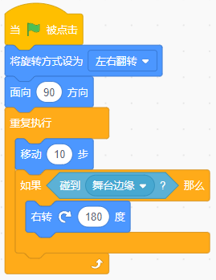

D. 

---

## 第6题（3分）
关于广播，下列说法错误的是？（ ）

A. 角色可以向其他角色和舞台发送消息

B. 舞台可以向角色和它自己发送消息

C. 角色不能向自己广播消息

D. 广播的消息，可以是字符串，也可以是变量

---

## 第7题（3分）
编写猫捉老鼠的游戏，想增加一个30秒的倒计时功能，①和②处应该填写？（ ）

 

A. 0，-1

B. 0，1

C. 30，1

D. 30，-1

---

## 第8题（3分）
运行下列哪个程序，能绘制出如下图所示的"彩色风车"图案？（ ）

A. 

B. 

C. 

D. 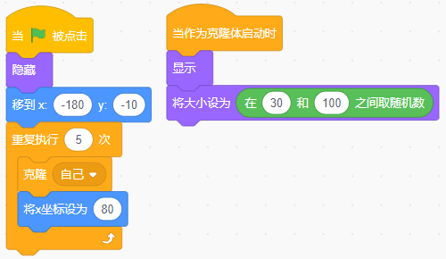

---

## 第9题（3分）
运行下列程序后，变量a的值不可能是？（ ）

A. 9

B. 10

C. 12

D. 13

---

## 第10题（3分）
一个正整数，如果它除以2的余数等于0，则是偶数；如果它除以2的余数等于1，则是奇数。下列哪个选项能说出1到100（包含1和100）之间所有的偶数？（ ）

A. 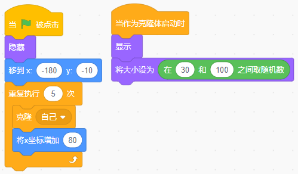

B. 

C. 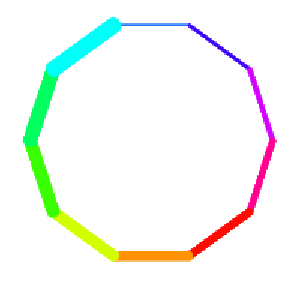

D. 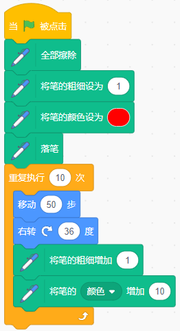

---

## 第11题（3分）
默认小猫角色，运行下列程序后，舞台上能看到的图案是？（ ）

A. 

B. 

C. 

D. 

---

## 第12题（2分）
默认小猫角色，运行下列程序后，说出的值是？（ ）

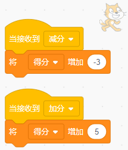

A. 80

B. 90

C. 100

D. 110

---

## 第13题（2分）
小强参加了踢毽子比赛，共有5个人参加，比赛前每两个小朋友都握一次手，问小强要握多少次手？（ ）

A. 1

B. 2

C. 3

D. 4

---

## 第14题（3分）
篮球的初始位置如下图所示，想让篮球下落到地面后，保持静止状态，下列哪个选项不能实现？（ ）

A. 

B. 

C. 

D. 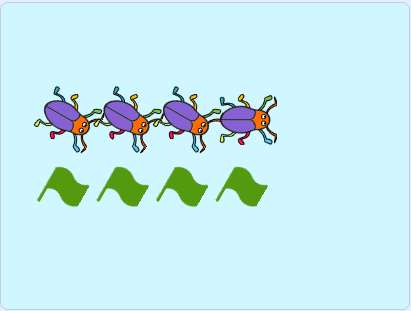

---

## 第15题（3分）
默认小猫角色，运行下列程序后，舞台上能看到几只小猫？（ ）

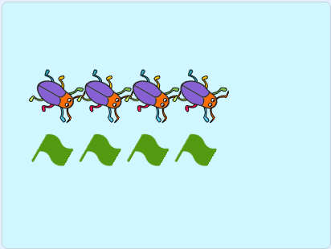 

A. 0

B. 4

C. 2

D. 1

---

## 第16题（3分）
默认小猫角色，运行下列程序后，舞台上能看到几只小猫？（ ）

A. 0

B. 1

C. 2

D. 3

---

## 第17题（3分）
气球初始位置如下图所示，想在舞台上方从左到右依次出现6个气球，应该运行下列哪个选项程序？（ ）

A. 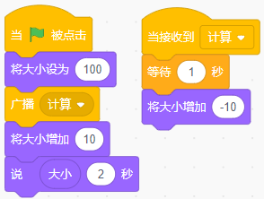

B. 

C. 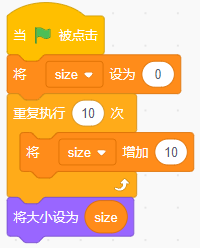

D. 

---

## 第18题（3分）
默认小猫角色，运行下列程序后，小猫会说？（ ）

A. 小猫先说"1"，再说"2"

B. 小猫会说"1"

C. 小猫会说"2"

D. 小猫什么也不说

---

# 二、判断题（共10题，共20分）

## 第19题（2分）
在一条长40米的小路一边植树，每隔5米种一棵，两端都要种，一共要种8棵树。（ ）

- 正确
- 错误

---

## 第20题（2分）
鸭子角色运行下列程序后，舞台上只能看见一只鸭子。（ ）

 

- 正确
- 错误

---

## 第21题（2分）
默认小猫角色，运行下列程序后，变量"数字"为11。（ ）

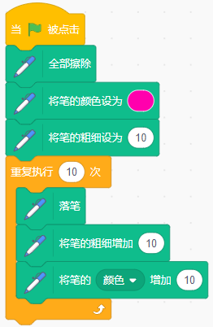

- 正确
- 错误

---

## 第22题（2分）
运行下列程序后，变量a的值为10。（ ）

- 正确
- 错误

---

## 第23题（2分）
默认小猫角色，运行下列程序后，小猫能够移动到舞台的随机位置。（ ）

- 正确
- 错误

---

## 第24题（2分）
下列积木可以将舞台上所有图形、角色和背景清除。（ ）

- 正确
- 错误

---

## 第25题（2分）
小猫角色中创建如下图所示的变量id，其他角色也能改变这个变量的值。（ ）

- 正确
- 错误

---

## 第26题（2分）
小猫角色在运行下列程序后，只要在舞台上单击鼠标，就会在当前位置上盖上小猫的图章。（ ）

- 正确
- 错误

---

## 第27题（2分）
棕熊的初始位置如下图所示，运行下列程序后，按下空格键，棕熊会说"你好！"2秒。（ ）

 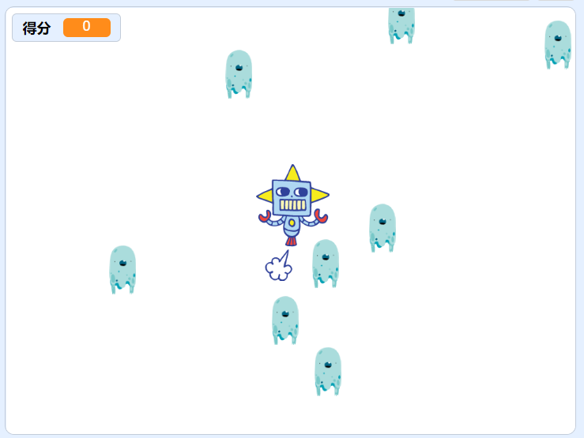

- 正确
- 错误

---

## 第28题（2分）
运行下列程序后，角色会一直说"等待中"，无法说出"结束"。（ ）

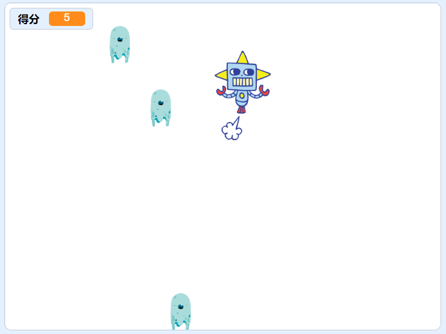

- 正确
- 错误

---

# 三、编程题（共3题，共30分）

## 第29题（10分）两位数减法

**1. 准备工作**

（1）保留默认小猫角色；

（2）添加背景：Chalkboard；

（3）新建变量"被减数"，"减数"和"得分"。

**2. 功能实现**

（1）程序开始时，小猫初始位置如下图所示，得分为0；

（2）点击绿旗，将变量"被减数"设为在50和100之间取随机数，将变量"减数"设为在10和50之间取随机数，小猫询问："被减数-减数=？"，例如："98-27=？"；

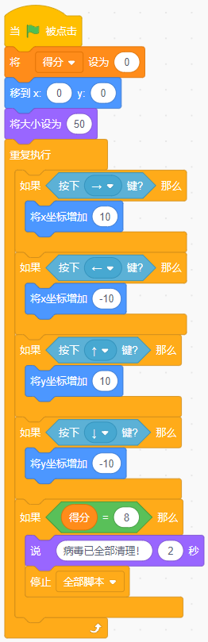

（3）输入答案，答对了，得分加1，小猫说"正确"2秒，否则说"错误"2秒。

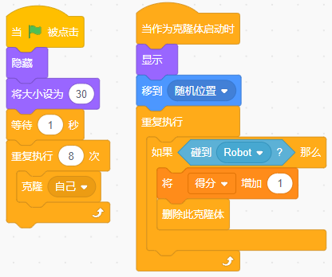

（4）重复出5个题目，最后小猫说"答对了x道题！"，例如："答对了3道题目！"

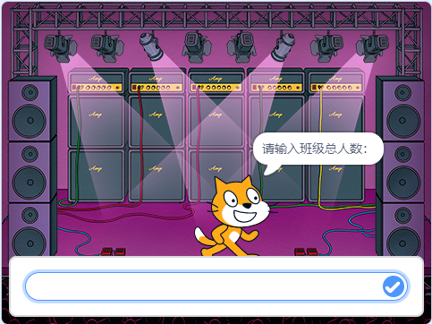

###### 作答链接： <a href="http://fslong.iok.la:32411/scratch/edit" target="_blank">右键新标签页打开答题</a>

---

## 第30题（10分）找钻石

**1. 准备工作**

（1）删除默认小猫角色，添加角色：Crystal和Giga；

（2）添加背景：Desert。

**2. 功能实现**

（1）程序开始，小精灵在舞台中心，钻石隐藏，变量得分为0；

（2）点击绿旗，询问"请输入钻石的个数"；

（3）输入个数后，舞台上出现相应数量的钻石；

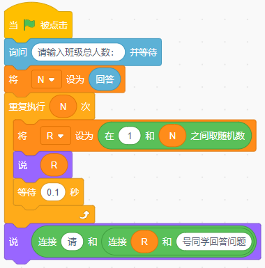

（4）等待2秒后，小精灵跟随鼠标移动，钻石碰到小精灵，得分增加1，钻石消失；

（5）当所有钻石都消失后，程序停止，小精灵不再跟随鼠标移动。

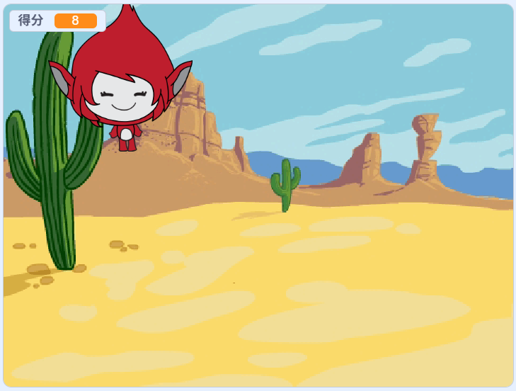

###### 作答链接： <a href="http://fslong.iok.la:32411/scratch/edit" target="_blank">右键新标签页打开答题</a>

---

## 第31题（10分）如意金箍棒

**1. 准备工作**

（1）删除默认小猫角色，添加角色：Monkey；

（2）绘制金箍棒角色：有两个造型，黄色和红色的椭圆，如下图所示；

（3）默认白色背景。

**2. 功能实现**

（1）程序开始，小猴子说"变大！"2秒；

（2）猴子说完后，使用图章，从下至上在舞台上绘制出金箍棒，注意两头为黄色椭圆，中间为红色椭圆，长度自定义，不超出舞台即可。

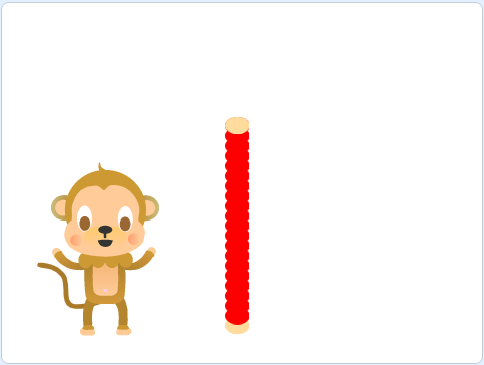

###### 作答链接： <a href="http://fslong.iok.la:32411/scratch/edit" target="_blank">右键新标签页打开答题</a>

---
