

# 202603图形化三级
> 编程非难事，只怕有心人。
> 图形化之巧，逻辑为先；积木之叠，思维为要。

---

# 一、单选题（共18题，共50分）

## 第1题（3分）
小丑鱼初始位置在舞台中央，初始状态为显示，运行一次下列程序后，舞台上最多能看到几只小丑鱼？（ ）

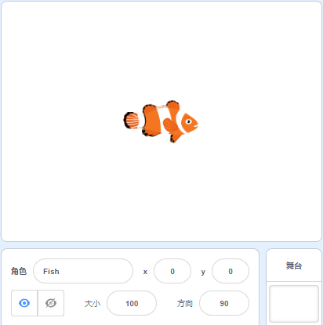 

A. 0

B. 5

C. 10

D. 11

---

## 第2题（3分）
气球的程序如下图所示，运行下列程序，说法正确的是？（ ）

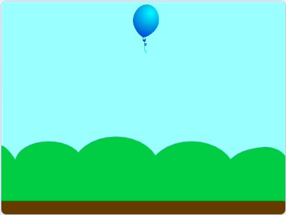 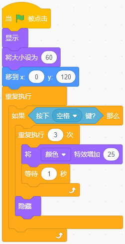

A. 点击绿旗后，气球会变换颜色三次后消失

B. 点击绿旗后，按下空格键，气球会变换颜色三次，不会消失

C. 点击绿旗后，按下空格键，气球会变换颜色三次后消失

D. 点击绿旗后，按下空格键，气球没有任何变化

---

## 第3题（3分）
默认小猫角色，点击绿旗后依次按下：→、↓、←、↑，绘制的图案是？（ ）

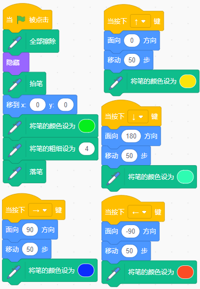

A. 

B. 

C. 

D. 

---

## 第4题（3分）
默认小猫角色，运行下列程序后能够绘制出如下右图所示的图案，程序中空缺部分应该分别填入多少？（ ）

 

A. 6，3

B. 3，6

C. 3，8

D. 3，3

---

## 第5题（3分）
关于变量的描述，下列说法错误的是？（ ）

A. 变量有三种显示方式：正常显示、大字显示、滑杆

B. 可以在程序中通过积木来控制变量显示和隐藏

C. 变量以滑杆方式在舞台上显示时，范围只能是0到100，但可以通过积木设置为任意值

D. 变量可以定义两类："适用于所有角色"和"仅适用于当前角色"，前者可以被所有角色和舞台修改，后者只能由角色自己修改

---

## 第6题（2分）
无人机正在执行巡逻任务，它的程序如下图所示，点击绿旗后，无人机的坐标变为？（ ）

A. (50,100)

B. (100,50)

C. (-50,100)

D. (100,-50)

---

## 第7题（3分）
小兔子所在班级有20个小朋友，1-4号小兔子去采蘑菇去了，请从剩下的小兔子中挑一只，去帮山羊伯伯拔草，用下列哪个最合适？（ ）

A. 

B. 

C. 

D. 

---

## 第8题（2分）
编写一个程序，当主持人说完："让我们一起倒数"后，所有的嘉宾都同时开始倒计时"9、8……"。使用下列哪个选项的方法可以实现？（ ）

A. 侦测主持人的声音

B. 侦测主持人的造型

C. 用重复执行直到

D. 广播消息

---

## 第9题（3分）
默认小猫角色，运行下列程序后，舞台能看到？（ ）

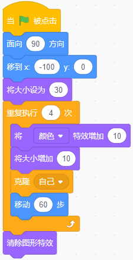

A. 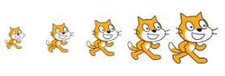

B. 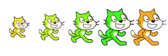

C. 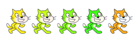

D. 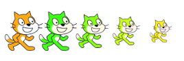

---

## 第10题（3分）
想在多次按下空格键后，绘制出如下图所示的图形，下列哪个选项的程序可以实现？（ ）

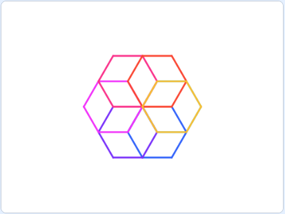

A. 

B. 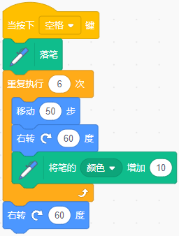

C. 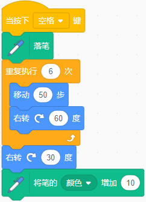

D. 

---

## 第11题（3分）
默认小猫角色，运行下列程序，变量a的值是？（ ）

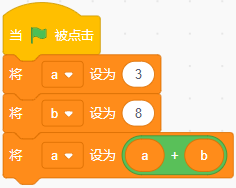

A. 11

B. 14

C. 19

D. 3

---

## 第12题（2分）
默认小猫角色，运行下列程序后，选项描述正确的是？（ ）

A. 程序一共运行了3秒

B. 小猫会一边切换造型一边往舞台中心移动

C. 小猫会先移动到舞台中心，再切换三次造型

D. 小猫会先切换三次造型，再移动到舞台中心点

---

## 第13题（3分）
默认小猫角色，运行下列程序后，小猫会说？（ ）

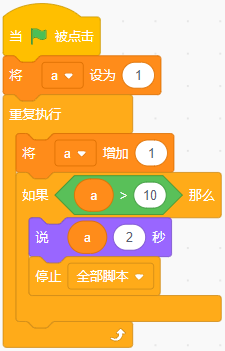

A. 10

B. 11

C. 12

D. 13

---

## 第14题（3分）
下列哪个选项可以实现，按下空格键河豚跳起，不按空格键就一直下落？（ ）

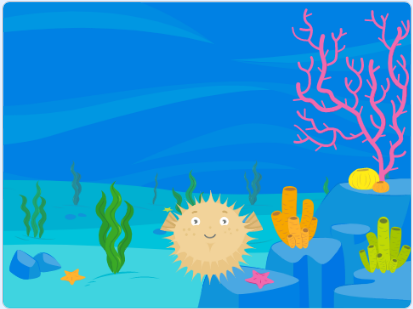

A. 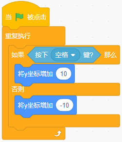

B. 

C. 

D. 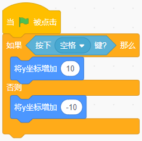

---

## 第15题（3分）
小刚从家到电影院有3种交通工具可选（公交、地铁、打车），从电影院到商场有4种路线可选（步行、骑行、共享单车、网约车），小刚从家经过电影院到商场共有几种出行组合？（ ）

A. 7

B. 10

C. 12

D. 15

---

## 第16题（2分）
观察图形规律，下一个图形是？（ ）

`□■□□■□□□■□？`

A. □

B. ■

C. ○

D. ●

---

## 第17题（3分）
红线的坐标为(150,0)，小猫运行下列程序后，小猫的大小变为？（ ）

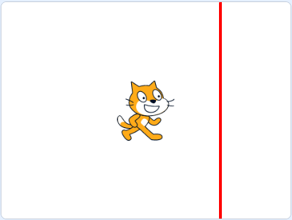 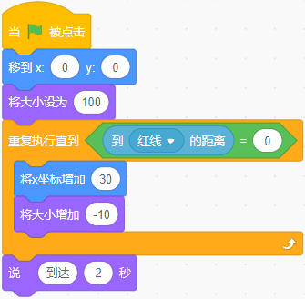

A. 100

B. 60

C. 50

D. 40

---

## 第18题（3分）
学校举行运动会，二年级的一班正在排练入场方阵。班长编写了如下图所示的程序来统计参与排练的总人数。当程序运行结束后，变量"总人数"的值是？（ ）

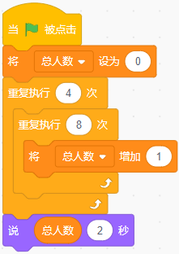

A. 12

B. 32

C. 24

D. 4

---

# 二、判断题（共10题，共20分）

## 第19题（2分）
运行下列程序后，角色会说出55。（ ）

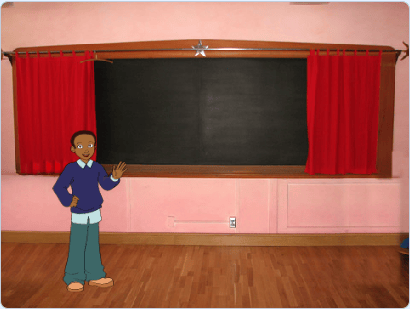 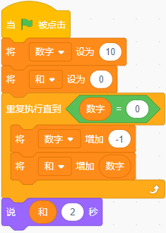

- 正确
- 错误

---

## 第20题（2分）
默认小猫角色，运行下列程序，可以绘制出如下右图所示的图形。（ ）

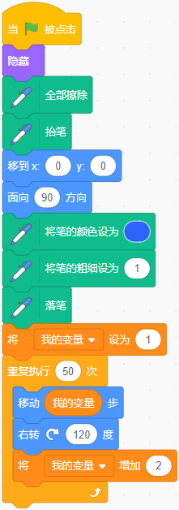 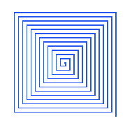

- 正确
- 错误

---

## 第21题（2分）
编写一个游戏，哪吒说动作名称，敖丙就表演动作。要保证程序正常运行，哪吒发送和敖丙接收的消息名称必须一致。（ ）

- 正确
- 错误

---

## 第22题（2分）
角色苹果运行下列程序，舞台上最多能看到两个苹果从舞台上方，下落到舞台下方后消失。（ ）

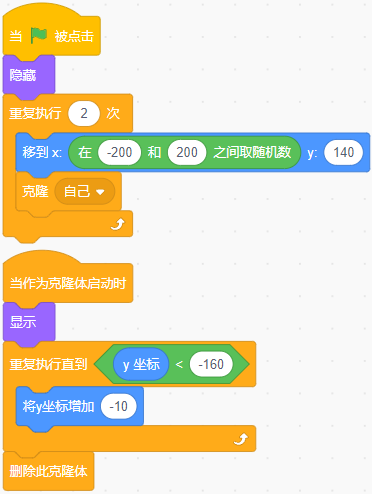

- 正确
- 错误

---

## 第23题（2分）
给四个机器人涂色，涂色规则如下：
(1) 每个机器人都用四种颜色涂装：红色、蓝色、绿色和黄色。
(2) 每个机器人都有独一无二的配色图案。这意味着绝不会有两个机器人在相同的部位涂上相同的颜色。
现在已经完成三个机器人的涂色，如图一所示，为了满足规则，第四个机器人应该像图二一样涂色。（ ）

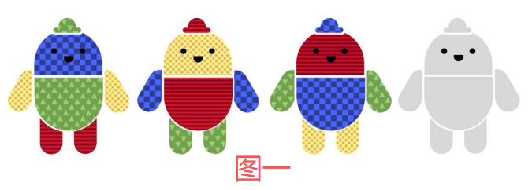 

- 正确
- 错误

---

## 第24题（2分）
使用下列积木，可以把舞台上所有的图案都擦除掉，舞台背景会变成白色。（ ）

- 正确
- 错误

---

## 第25题（2分）
运行下列程序后，变量a的值为2，变量b的值为1。（ ）

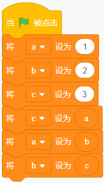

- 正确
- 错误

---

## 第26题（2分）
默认小猫角色，运行下列程序，小猫可以说出0。（ ）

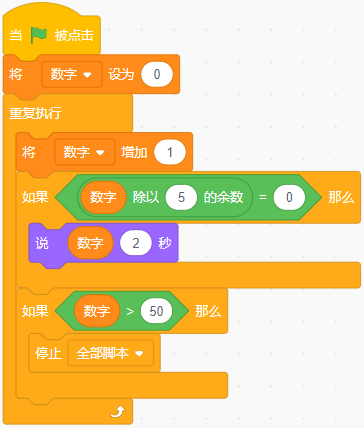

- 正确
- 错误

---

## 第27题（2分）
下列积木的结果是5和45之间的一个整数。（ ）

- 正确
- 错误

---

## 第28题（2分）
默认小猫角色，运行下列程序后，角色坐标变为(100,100)。（ ）

- 正确
- 错误

---

# 三、编程题（共3题，共30分）

## 第29题（10分）穿越陨石带

**1. 准备工作**

（1）删除默认小猫角色，添加角色：Rocketship，Rocks；

（2）添加背景：Galaxy，在背景最右侧绘制一条绿色粗线，代表安全区。

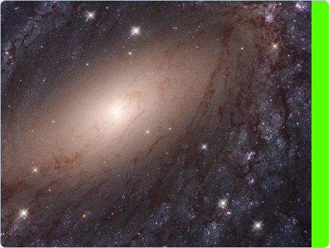

**2. 功能实现**

（1）点击绿旗，飞船出现在屏幕左侧，通过键盘的"上下左右"键控制飞船移动，方向始终朝右；

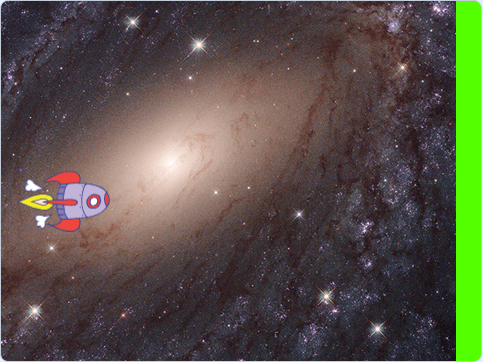

（2）陨石出现在屏幕最右侧，每隔0.5秒克隆一次，克隆体y坐标随机；

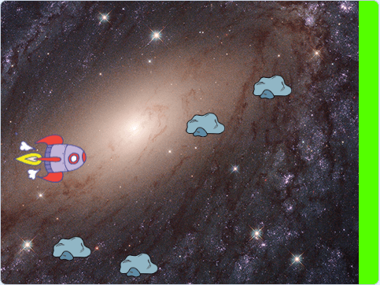

（3）陨石水平向左移动，到达舞台最左侧后，消失；

（4）火箭碰到绿色，到达安全区，游戏结束；

（5）火箭碰到陨石，游戏结束。

###### 作答链接： <a href="http://fslong.iok.la:32411/scratch/edit" target="_blank">右键新标签页打开答题</a>

---

## 第30题（10分）魔法商店

小精灵Gobo在魔法药水铺当学徒。今天老板不在，他需要自己给客人结账。每瓶"隐形药水"的价格每天都不一样。请你帮他写一个自动结账程序。

**1. 准备工作**

（1）删除默认小猫角色，添加角色：Gobo；

（2）添加背景：Spaceship；

（3）创建两个变量：单价和购买数量。

**2. 功能实现**

（1）点击绿旗，将变量[单价]设为10到30的随机数，将变量[购买数量]设为2到5的随机数；

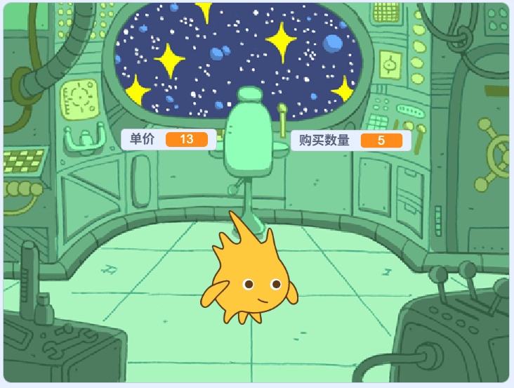

（2）小精灵说"一共需要 XXX 金币"（注：XXX需程序自动计算）2秒；

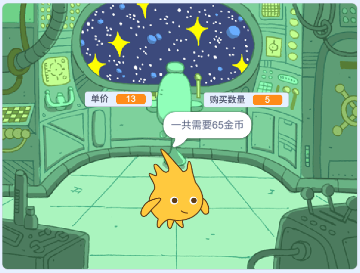

（3）小精灵询问："请问您支付多少金币？"并等待；

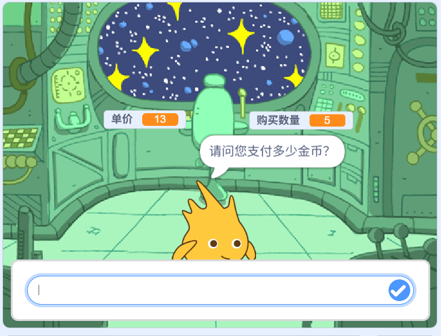

（4）如果客人的回答 = 总价，Gobo说："金额刚好，欢迎下次光临"；

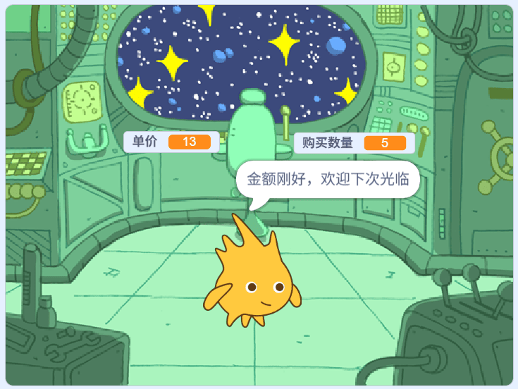

（5）如果客人的回答 > 总价，Gobo需要计算并说出："找您 [差额] 金币"；

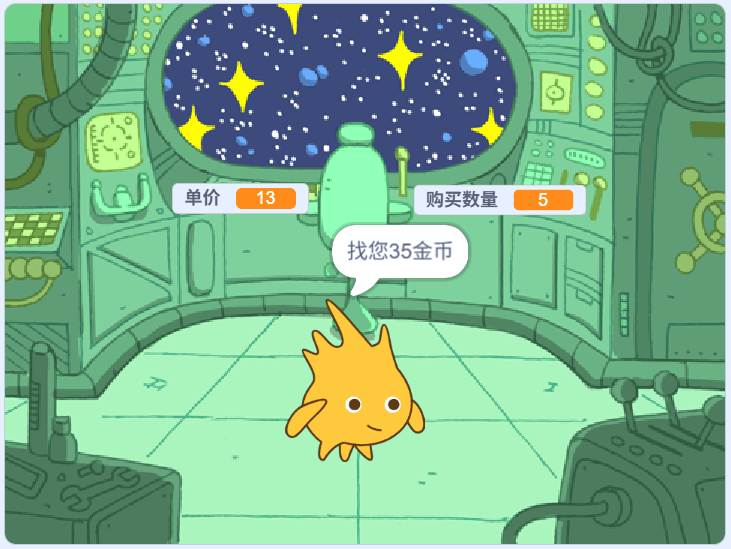

（6）如果客人的回答 < 总价，Gobo说："对不起，您的金币不够哦！"。

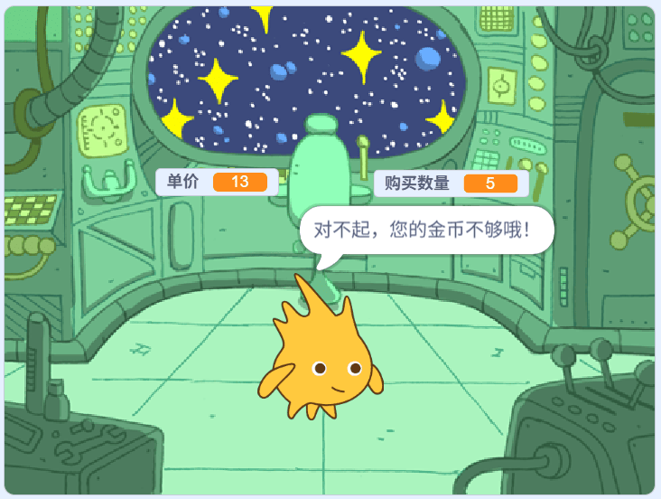

###### 作答链接： <a href="http://fslong.iok.la:32411/scratch/edit" target="_blank">右键新标签页打开答题</a>

---

## 第31题（10分）蜂巢履带

**1. 准备工作**

（1）默认小猫角色；

（2）默认白色背景。

**2. 功能实现**

（1）设置画笔的粗细为2，正六边形的边长为60；

（2）绘制如下图所示的5个正六边形，每两个正六边形之间的间距为70；

（3）五个正六边形，颜色各不相同。

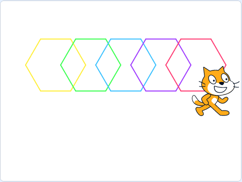

###### 作答链接： <a href="http://fslong.iok.la:32411/scratch/edit" target="_blank">右键新标签页打开答题</a>

---

