

# 2025年5月24日 图形化三级作业
> 温故而知新，可以为师矣。

---

# 一、单选题（共10题，共20分）

## 第1题（2分）
在《采矿》游戏中，当角色捡到黄金时财富值加1分，捡到钻石时财富值加2分，下面哪个程序实现这个功能？（ ）

A. 

B. 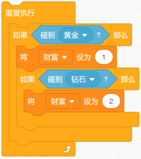

C. 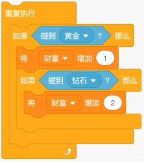

D. 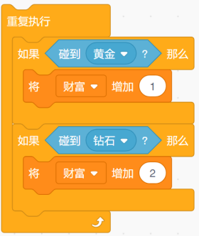

---

## 第2题（2分）
设计一个和在20以内（包括20）的整数加法程序，已知其中一个数为7，另一个数用随机数积木表示，下面几个积木中，哪个最为合适？（ ）

A. 

B. 

C. 

D. 

---

## 第3题（2分）
设计《新年焰火晚会》程序，每发送一个指令燃放一批焰火（不同焰火角色），焰火消失后再发出下一指令，从而控制下一批焰火的燃放。下面哪个程序最合适？（ ）

A. 

B. 

C. 

D. 

---

## 第4题（2分）
下面哪个程序多次运行后，角色"说"出的结果可能大于20？（ ）

A. 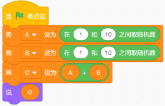

B. 

C. 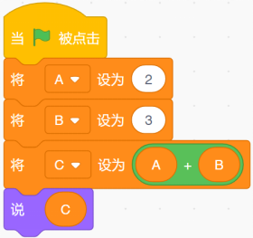

D. 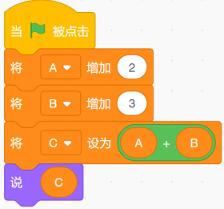

---

## 第5题（2分）
能得到下面图形是哪个脚本？（ ）

A. 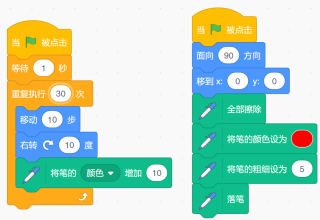

B. 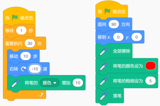

C. 

D. 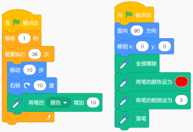

---

## 第6题（2分）
舞台均匀放置4个气球，小猫位于当前位置，执行下面的程序，正确的说法是？（ ）

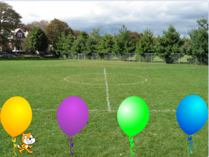 

A. 小猫跑到中间遇到绿色气球停止

B. 小猫跑到右边遇到蓝色气球停止

C. 小猫会一直跑

D. 小猫遇到黄色气球停止

---

## 第7题（2分）
下面的程序执行5分钟后，将会产生多少个克隆体？（ ）

A. 无数个

B. 3000个左右

C. 300个左右

D. 1023个左右

---

## 第8题（2分）
执行下面程序，画出的图形是？（ ）

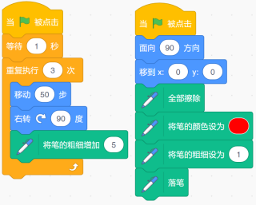

A. 

B. 

C. 

D. 

---

## 第9题（2分）
角色从图形中心的位置开始绘制，哪个选项可以绘制出下面的图案？（ ）

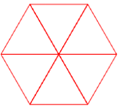

A. 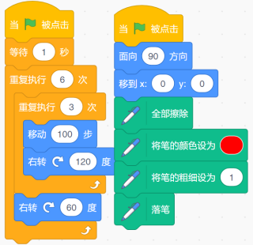

B. 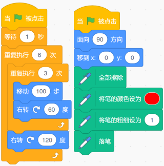

C. 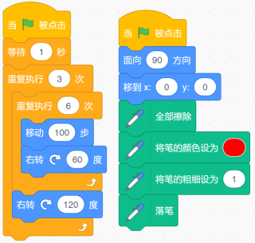

D. 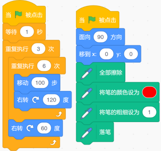

---

## 第10题（2分）
下面这个程序有Bug，执行程序后，哪个说法是正确的？（ ）

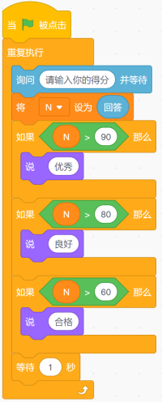

A. 输入60分，说"合格"。

B. 输入80分，说"良好"。

C. 输入90分，说"优秀"。

D. 输入50分，什么也不说。

---

# 二、判断题（共5题，共10分）

## 第11题（2分）
下面的积木，不能得到1到10的随机整数。

- 正确
- 错误

---

## 第12题（2分）
执行下面程序，变量N的值不会超过50。

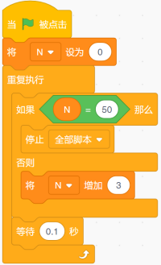

- 正确
- 错误

---

## 第13题（2分）
执行下面程序，角色从1数到10。

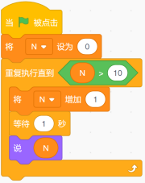

- 正确
- 错误

---

## 第14题（2分）
"全部擦除"指令将清除舞台上所有存在的图形，包括角色和背景。

- 正确
- 错误

---

## 第15题（2分）
执行下面程序后，N的结果为6。

- 正确
- 错误

---

# 三、编程题（共1题，共10分）

## 第16题（10分）小鸡吃虫

**1. 准备工作**

（1）选择背景Garden-rock，删除原空白背景；

（2）选择角色Grasshopper、Chick，置于舞台图示位置，设置Grasshopper的初始大小为30%，状态为隐藏；删除小猫；

（3）建立全局变量"得分"，在舞台显示为"正常显示"。

**2. 功能实现**

（1）点击绿旗后，角色Chick满屏幕走动；

（2）点击绿旗后，角色Grasshopper每隔1秒克隆一次，克隆体出来后立即显示，并每隔1秒移动到舞台随机位置；

（3）变量"得分"初始值设定为0，角色Grasshopper的克隆体碰到Chick，"得分"加1，如果"得分"为10，则游戏结束。

###### 作答链接： <a href="http://fslong.iok.la:32411/scratch/edit" target="_blank">右键新标签页打开答题</a>

---
