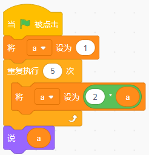
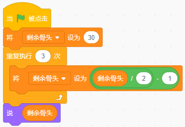
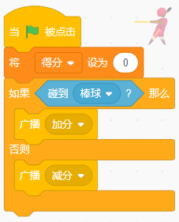

# 2026年6月7日 图形化三级作业
> 温故而知新，可以为师矣。

---

# 一、单选题（共10题，共70分）

## 第1题（7分）
关于广播的说法，下面哪个是正确的？（ ）

A. 广播指令发出后，只有自己可以接收到。

B. 广播指令发出后，只有其它角色可以接收到。

C. 广播指令发出后，所有角色都可以接收到。

D. 背景不能接收广播的消息。

---

## 第2题（7分）
关于克隆体的说法，下面哪个选项是正确的？（ ）

A. 角色只能克隆自己，不能克隆其它角色。

B. 如果本体隐藏，是无法实现克隆的。

C. 克隆体克隆出来后，克隆体可以执行"克隆"积木后的程序。

D. 克隆体克隆出来后，会执行"当作为克隆体启动时"后面的程序。

---

## 第3题（7分）
下面哪种说法正确？（ ）

A. 在舞台上击右键，可以新建变量。

B. 在代码区击右键可以新建变量。

C. 可以在程序中用"新建变量"积木新建变量。

D. 只能在积木区"变量"中，通过点击"新建一个变量"按钮建立变量。

---

## 第4题（7分）
在《龟兔赛跑》游戏中，当"小猫"发出指令："预备-跑"后，小乌龟及小兔子开始跑起来，而旁边的其它小动物都在为它们加油，要实现这个程序，用下面哪种方法最方便？（ ）

A. 侦测小猫的声音

B. 侦测小猫的造型

C. 广播消息

D. 无法实现

---

## 第5题（7分）
有17个男生和13个女生围成一圈，至少有几个男生旁边也是男生？（ ）

A. 4个

B. 5个

C. 6个

D. 8个

---

## 第6题（7分）
下面哪个不是变量在舞台上的显示模式？（ ）

A. 正常模式

B. 大字模式

C. 小字模式

D. 滑杆模式

---

## 第7题（7分）
已知四个变量a=10，b=20，c=30，d=40，执行下面程序，角色会说？（ ）

A. 10

B. 40

C. true

D. false

---

## 第8题（7分）
三人参加短跑比赛，甲说我不是第一，乙说我不是第二，丙说甲是第三。则他们的获奖情况是？（ ）

A. 甲是第一，乙是第二名，丙是第三名。

B. 甲是第三，乙是第二名，丙是第一名。

C. 甲是第三，乙是第一名，丙是第二名。

D. 甲是第二，乙是第一名，丙是第三名。

---

## 第9题（7分）
下面哪个程序，点击5次绿旗，每次变量A的值都可能不同的是？（ ）

A. 

B. 

C. 

D. 

---

## 第10题（7分）
执行下面程序，角色将说出？（ ）

A. Windows

B. Macos

C. sa

D. wM

---

# 二、判断题（共5题，共30分）

## 第11题（6分）
"克隆"和"图章"都可以复制出新的角色，不过图章出来的角色不能用移动指令。

- 正确
- 错误

---

## 第12题（6分）
背景里也可以建立局部变量，并被角色所使用。

- 正确
- 错误

---

## 第13题（6分）
修改变量名，程序中对应的变量名会自动改变。

- 正确
- 错误

---

## 第14题（6分）
"广播消息并等待"积木发出消息后，要等待所有接收消息的代码执行完成后才继续向下执行。

- 正确
- 错误

---

## 第15题（6分）
抬笔后移动画笔，不能在舞台画出图形。

- 正确
- 错误

---

# 三、编程题（共1题，共30分）

## 第16题（30分）加法出题机

**1. 准备工作**

（1）保留空白背景；

（2）保留原默认小猫角色，选择Button2，在造型选项卡里为其添加文字"开始"。各角色置于舞台合适位置；

（3）建立4个全局变量"A"（加数）、"B"（另一个加数）、"C"（和）、"得分"。除"得分"在舞台正常显示外，其余均隐藏。

**2. 功能实现**

（1）点击绿旗后，所有变量初始化值为0；

（2）点击"开始"按钮，发送开始指令；

（3）当小猫接收到开始指令，向用户出示加数在1-99范围内的加法题；

（4）每答对一题，小猫说"正确"，加10分；得分100分程序结束。

###### 作答链接： <a href="http://fslong.iok.la:32411/scratch/edit" target="_blank">右键新标签页打开答题</a>

---
