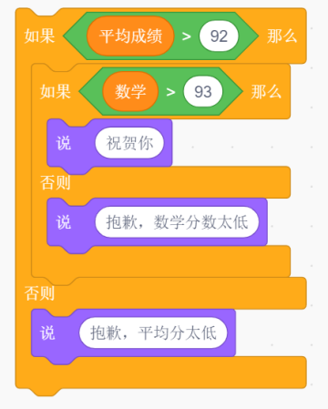
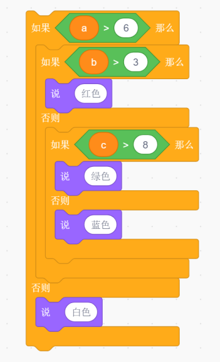
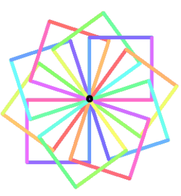
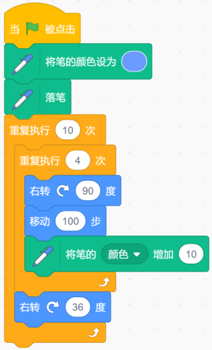
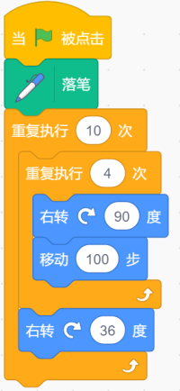
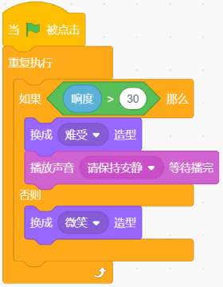
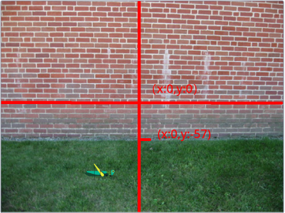
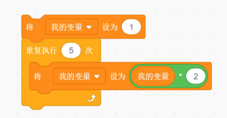

# 202106图形化三级-练习卷

> 选取有图片题目，共16题，满分50分

---

# 一、单选题（共10题，共20分）

## 第1题（2分）
下图中的程序执行一次之后，"我的变量"最终的值是？（ ）

A. 0或者1

B. true或者false

C. 包含或者不包含

D. 成立或者不成立

---

## 第2题（2分）
如果你的平均成绩是93分，数学是95分，运行下面程序后角色会？（ ）

A. 说"祝贺你"

B. 说"抱歉，数学分数太低"

C. 说"抱歉，平均分太低"

D. 什么都不说

---

## 第3题（2分）
如果a=7，b=2，c=9，执行下面程序后，角色会说？（ ）

A. 红色

B. 绿色

C. 蓝色

D. 白色

---

## 第4题（2分）
以下选项执行一次之后能够画出下图中的图形的是？（ ）

A. 

B. 

C. 

D. 

---

## 第5题（2分）
运行下面程序后，角色说的内容不可能是？（ ）

A. 2.2472129659666074

B. 1.37

C. 9.6

D. 7

---

## 第6题（2分）
"旋转跳跃我不停歇……"，小猫随着歌声翩翩起舞，并且记录了自己的每一个动作，以下选项中的程序执行一次之后没有记录小猫舞蹈动作的是？（ ）

A. 

B. 

C. 

D. 

---

## 第11题（2分）
在国王组织的春游活动中小猫的背包里面装了好朋友最喜欢的香蕉，小猴子的背包里面装了好朋友最喜欢的小鱼干，以下选项中能够让两位好朋友背包内的东西互换的是？（ ）

A. 

B. 

C. 

D. 

---

## 第12题（2分）
执行下面程序后，说的结果？（ ）

A. 4

B. 5

C. 4.5

D. 6

---

## 第13题（2分）
科技达人Casey给图书馆做了一款噪音检测提示系统，当图书室声音小于等于30时，画面显示笑脸，当声音大于30时，显示难受的表情，并且语音提示"保持安静"。以下哪个选项可以实现这个检测功能？（ ）

A. 

B. 

C. 

D. 

---

## 第15题（2分）
在捉蚱蜢游戏中，背景如下图所示，能够实现蚱蜢在整片草地的随机位置出现的选项是？（ ）

A. 

B. 

C. 

D. 

---

# 二、判断题（共5题，共10分）

## 第26题（2分）
图章工具能够复制角色的所有外观属性，例如大小、显示、隐藏、颜色、虚像、马赛克等特效。

- 正确
- 错误

---

## 第28题（2分）
随机数积木只能生成指定范围内的随机整数。

- 正确
- 错误

---

## 第30题（2分）
变量名可以用字母、数字、特殊符号等命名。

- 正确
- 错误

---

## 第32题（2分）
如果a的值为95，执行下面程序，角色会说"成绩相当好"。

- 正确
- 错误

---

## 第33题（2分）
执行下列程序后，我的变量的值是32。

- 正确
- 错误

---

# 三、编程题（共1题，共20分）

## 第36题（20分）躲球游戏

控制小猫尽量躲开小球。

 

**1. 准备工作**

（1）背景：使用原始空白背景；

（2）角色：除原有小猫角色外，添加角色：Ball；

（3）变量：建立变量"分数"。

**2. 功能实现**

（1）用上、下、左、右方向键控制小猫移动；

（2）使用克隆，克隆出6个球；

（3）克隆体出现在随机位置，面向随机方向移动，碰到边缘就反弹；

（4）分数一直变化，是计时器的数值，时间越长，分数越高；

（5）当小猫碰上小球，小猫和小球全部消失，出现"游戏结束"四个字，游戏结束。

---

**作答链接：** <a href="http://fslong.iok.la:32411/scratch/edit" target="_blank">右键新标签页打开答题</a>

---
