

# 202106图形化三级-练习卷

> 选取有图片题目，共16题，满分50分

---

# 一、单选题（共10题，共20分）

## 第1题（2分）
下面程序执行一次之后，角色说出的内容不可能是？（ ）

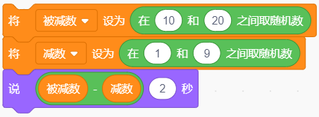

A. 1

B. 11

C. 20

D. 2

---

## 第2题（2分）
在跑步比赛中，起点裁判发布消息"预备"，等待终点裁判准备就绪后，起点裁判才会下达"开始"的命令。下面哪个选项可以实现这个功能？（ ）

A. 

B. 

C. 

D. 

---

## 第3题（2分）
下面程序绘制的图形是？（ ）

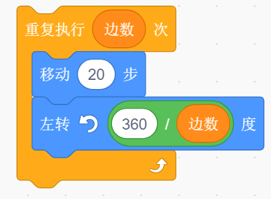

A. 只能绘制正四边形

B. 只能绘制正五边形

C. 可以绘制任意长度的多边形

D. 改变变量边数的值，可以绘制不同的正多边形

---

## 第4题（2分）
角色A的程序如左图所示，角色B的程序如右图所示。点击绿旗，什么时候说"真棒"？（ ）

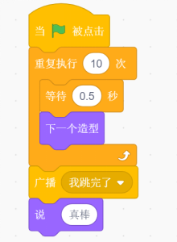  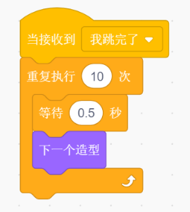

A. 角色A开始切换造型时

B. 角色A造型切换十次完成后

C. 角色B造型切换十次完成后

D. 不会说此句

---

## 第5题（2分）
下图中的程序执行一次之后，变量a、b的值分别是多少？（ ）

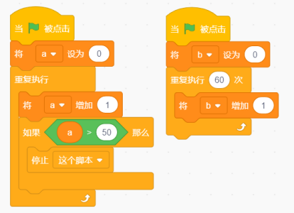

A. 50 60

B. 50 61

C. 51 60

D. 51 61

---

## 第6题（2分）
默认小猫角色，初始位置在舞台中心，下面程序执行一次后，下面哪个选项是正确的？（ ）

A. 小猫走动一段距离后，停下来，但是没有颜色变化

B. 小猫原地不动，但颜色发生变化

C. 小猫来回走动，同时颜色发生变化

D. 小猫走动一段距离后，停下来，接着颜色不停的发生变化

---

## 第7题（2分）
执行下面程序，角色会说？（ ）

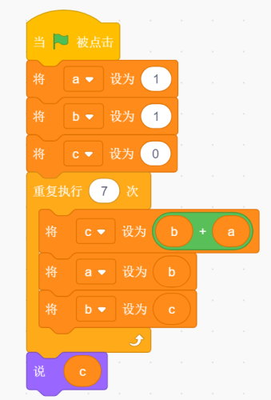

A. 34

B. 28

C. 51

D. 42

---

## 第8题（2分）
小猫和小伙伴玩扔骰子走格子游戏。在游戏中小猫和小伙伴会根据背景中的方格指示运动和并能自动转向，且移动一步刚好是一个方格。游戏背景图如下第一张图所示，那么按照第二张图中的程序，重复执行直到里的程序最少执行多少次，小猫能够到达终点？（ ）

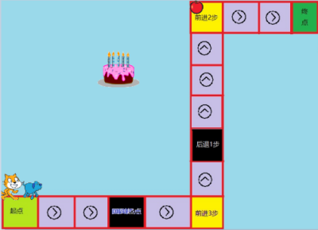  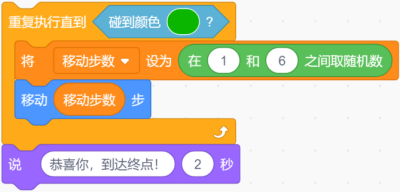

A. 2

B. 3

C. 4

D. 5

---

## 第9题（2分）
下面程序画出的图形是？（ ）

A. 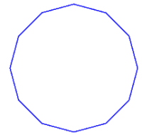

B. 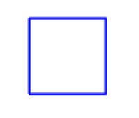

C. 

D. 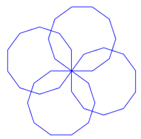

---

## 第10题（2分）
小猫和角色bell在舞台左侧边缘，如下图所示。小猫的程序如下图所示，角色bell没有任何程序，执行下面程序一次后，舞台上出现的内容是？（ ）

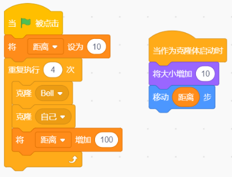  

A. 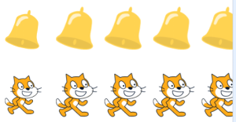

B. 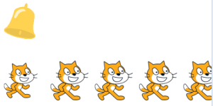

C. 

D. 

---

# 二、判断题（共5题，共10分）

## 第11题（2分）
广播和变量都能起到在角色之间进行信息传递的作用。

- 正确
- 错误

---

## 第12题（2分）
在程序编写中，只要使用了"重复执行"就会造成死循环。

- 正确
- 错误

---

## 第13题（2分）
使用画笔中的落笔积木后必须使用抬笔，才能够在舞台上画出痕迹。

- 正确
- 错误

---

## 第14题（2分）
广播也可以像变量一样设定其作用范围为"适用于所有角色"和"仅适用于当前角色"两种状态。

- 正确
- 错误

---

## 第15题（2分）
角色可以克隆自己也可以克隆别的角色及舞台。

- 正确
- 错误

---

# 三、编程题（共1题，共20分）

## 第16题（20分）绘制图形

**1. 准备工作**

（1）默认的白色背景；

（2）默认的小猫角色。

**2. 功能实现**

（1）画笔的颜色为黑色，画笔的粗细为3；

（2）绘制如下的图形，边长自定义，图形不能超出舞台范围。

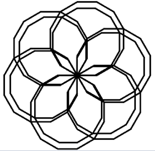

---

**作答链接：** <a href="http://fslong.iok.la:32411/scratch/edit" target="_blank">右键新标签页打开答题</a>

---
